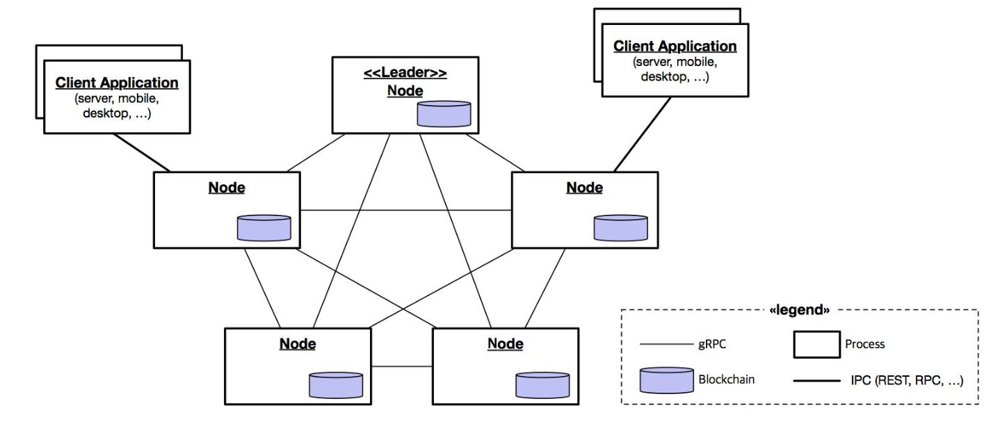
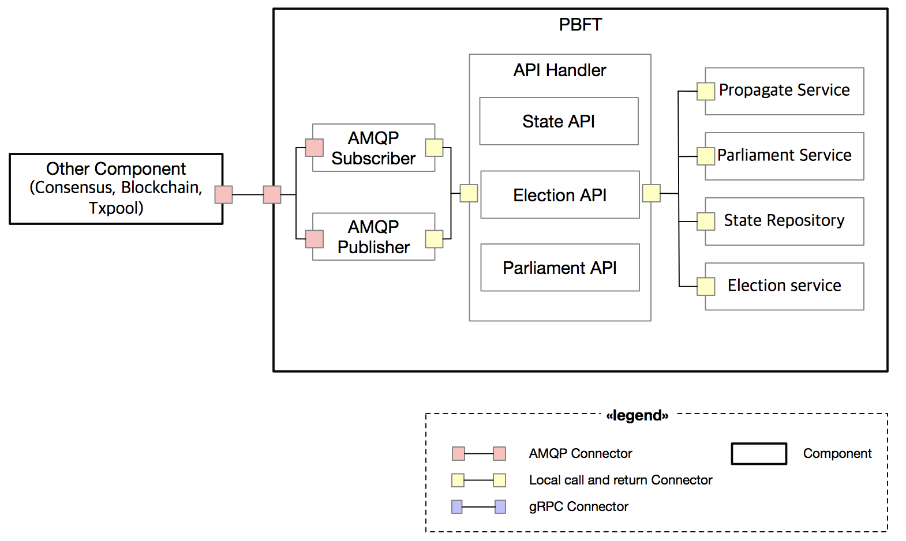
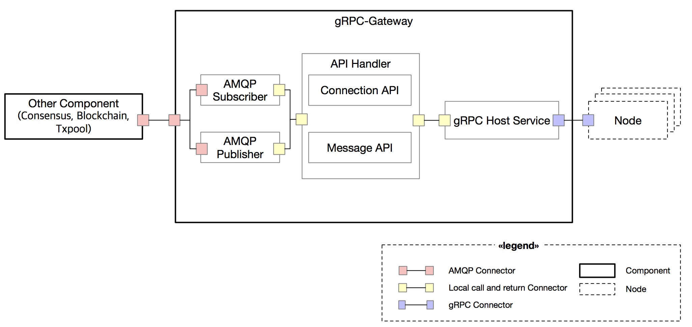
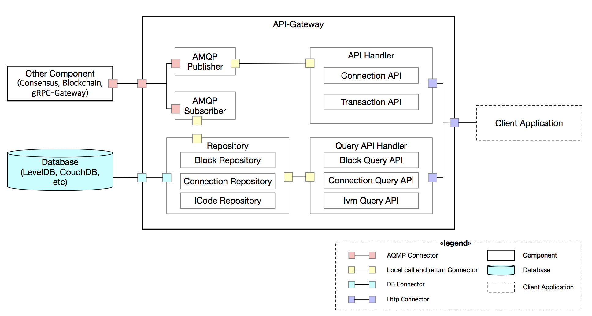
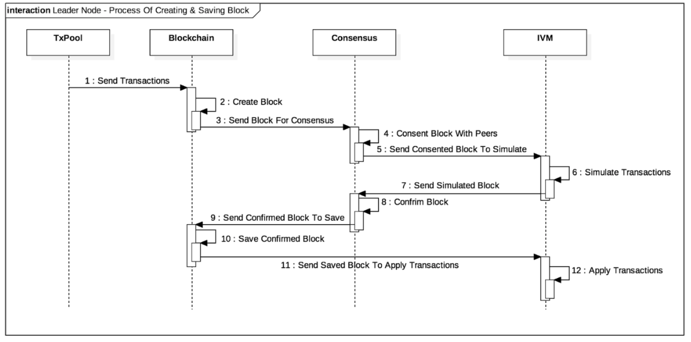
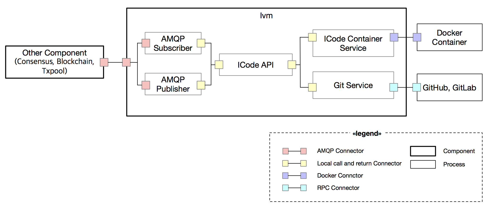
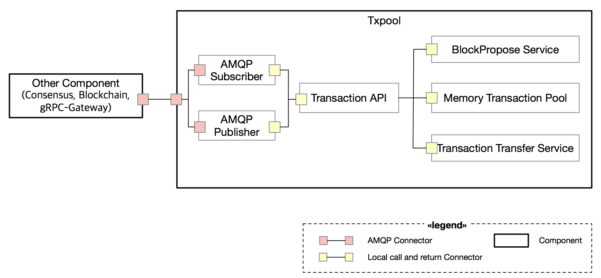

# Architecture of It-chain

## 1.  Development Background and Purpose

Existing blockchain are so large and complex that they have high entry barriers to use in non-IT small and medium communities such small merchant associations. In addition, conventional blockchain such as etherium, bitcoin, and hyperledger fabric and sawtooth are difficult to modify to suit their purposes.

When someone wants to learn more deeply about the blockchain, there is a lot of data related to the general blockchain theory, but there is little data and open source about how to actually implement the block chain using that theory. 

To solve these problems, `the project aims to create a lightweight customized blockchain(It-chain)` that can be flexibly modified by small and medium-sized communities to suit their purposes. The It-chain is a blockchain with an easy-to-modify structure, so that people using it-chain can easily modify it according to their needs. In addition, the it-chain is an open-source solution to many problems, such as the PBFT agreement algorithm and the RAFT reader selection algorithm, which are widely known to people through the general theory of block chaining. I would like to present one of them.

It also enables people to understand, not only through code implementation, but also through in-depth documentation. A detailed description of each component is provided in the document and the figure. Because it covers not only the principles of operation but also the various definitions for architecture and development, we can lower the entry barriers of developers who are willing to contribute to open source.

 

## 2. Development Env and Development Language

- Development Env: OSX, Linux

- Development Language: Golang >= 1.9

- Development Requirement: Docker >= 17.12.0 , Rabbitmq >= 3.7.7

   

## 3.  System Architecture

### Architecture of It-chain Network
 It-chain is a private blockchain based on a CA (Certificate Authority). The It-chain network consists of a `leader` and a `general node`, and each node is connected to all nodes participating in the network by `gRPC`. The leader node is responsible for the start of the block generation and the agreement algorithm and is replaced periodically. The remaining general nodes verify and agree on the block created by the reader, sign the transaction received from the client application, and deliver it to the reader. A client application can request any of the It-chain networks.

### Architectuee of It-chain Node

The It-chain node-level architecture model is shown in the figure above. The it-chain consists of six independently operating core components, each communicating via the Asynchronous Message Queue Protocol (AMQP). AMQP is an event bus connector that generates and distributes events for internal core components according to an external message coming into the gateway. Each core component operates by receiving events that it has already registered. A specific implementation of AMQP uses RabbitMQ.

 

The it-chain node is connected to an external network node (another it-chain node or client applications) via two gateway components (Client API Gateway and gRPC Gateway).

- Client Gateway  : It is provided as REST API for client applications (server, mobile app, desktop app, etc).
- gRPC Gateway  :  It is a service for communication between nodes. It handles communication related to the block chain such as block sink, agreement message, and so on.

Each component of the it-chain has its own data for operation (see Micro Service Architecture structure). Therefore, in some cases, the same data can be stored in duplicate in different components, which allows this. 

- TxPool component: A component that temporarily stores and manages transactions, and collects transactions that are not agreed upon and stored in the block. 
- Consensus component: This is the component responsible for the consensus, and now conforms to the Practical Byzantine Fault Tolerance (PBFT) algorithm. 
- BlockChain component: A component that creates, sinks, verifies and manages blocks. 
- Ivm component: It is responsible for iCode-related functions which are smart contract of it-chain.

As such, the it-chain is advantageous in that it can be easily modified according to the user's needs because each completely independent component forms a whole system. For example, if you want to change the PBFT agreement algorithm that is currently used in the it-chain, you only need to replace the domain logic of the consensus component. Alternatively, if you want to change the block structure of a block chain, you can satisfy the need by simply replacing the domain logic of the blockchain component.

 

### Consensus

 The consensus component plays a role for the members of the peer-to-peer network to agree on the storage order of the blocks for the blocks generated in the blockchain component. In the It-chain, this consensus process is implemented through the PBFT agreement algorithm, and the leader of the PBFT is selected through the RAFT leader selection algorithm.

The consensus process begins by proposing a block to be agreed upon by the elected leader, and a parliament is formed, which is a set of Representatives participating in the consensus process for the block proposed by the leader. Representatives constituting the parliament are selected among all the nodes constituting the P2P network. Currently, all the nodes at the time of proposing a block are selected as representatives . After the parliament is formed, the consensus sends AMQP through the block consent request event, the block consent completion event, the consensus message (Propose, PreVote, PreCommit). The State API is an API that performs block agreement. When a block agreement is requested, the agreement message is exchanged with another node and agreed. The Election API is an API that selects the leader to start a timer to set a leader candidate or vote for a leader candidate. The Leader API performs functions such as updating the leader.

 

### gRPC-Gateway

gRPC-Gateway is responsible for communication between nodes participating in it-chain network. gRPC-Gateway maintains connections with all nodes in the network through gRPC Bi-stream and manages connections

gRPC-Gateway communicates with another component of the same node using Async Message Queue Protocol (AMQP), and has a Connection API that handles connection related functions and a Message API that processes a message transmission request to other nodes Receive requests and process them. Both the Connection API and the Message API use the gRPC Host service to manage the connection with the node and to send the message to the node

 

### API-Gateway

The API-Gateway handles HTTP requests from clients. Requests from clients are divided into data changes (Create, Update, Delete) and queries. The Query API handler receives a query request and performs a function of retrieving a block, a transaction, an ICode, and a connection from a repository. The API Handler receives the data change request and sends a request to AMQP such as Transaction Submit and ICode Deploy to the corresponding component.  

The AMQP Handler receives the creation, update, and deletion events of Block, Connection, and ICode from other components and stores data for query independently in the DB. The Query API retrieves data from the DB. In this way, the API-Gateway is separated from other components to separate the data inquiry logic and the data change logic.

 

### Blockchain

The blockchain component performs functions such as block creation, storage, and synchronization. AMQP is used to collaborate with various components. Generally, a block is generated by using a transaction received from a transaction pool component (TxPool Component), and a block is transferred to a consensus component for aggrement. After receiving consensus blocks from the consensus component, they are verified and stored.

If it is a leader node, it receives a request from a transaction pool component (TxPool Component), generates a block, and requests a consensus component for a block agreement. When the consensus component completes the agreement, all nodes in the network store the block in the blockchain

The block chain synchronization is a process for making all block nodes in the network equal to each other. When a new node participates in the network, block chain synchronization with other nodes proceeds

### Ivm

The ivm component (ICode Virtual Machine Component) is a component that runs and manages ICode, the smart contract of it-chain. ICode Container Service is used to manage ICode in each independent docker environment, and ICode is deployed from GitHub and GitLab via Git Service. Deploy supports the Git SSH protocol and HTTPS. When deploying using the Git SSH protocol, you can optionally use the SSH key.

Each ICode is assigned an ICode ID by using the Git URL of the ICode and the commit hash of the head when deploying. Therefore, if you deploy the same version ICode in any node, it will have the same ICode ID. When the IVM receives a block commit event of a blockchain component, it executes the ICode of the transactions in the block. Also, ICode is executed to inquire the value of the state by a state query request.

### Txpool

Txpool verifies the submitted transaction and sends a block creation request to the blockchain component if it is a leader node and a transaction to the leader node if it is a normal node . Submitted transactions to the API-Gateway are delivered to Txpool by AMQP and are stored in the Transaction pool after validation by the Transaction API. Two batch threads are executed in Txpool, each of which takes a transaction from the transaction pool and sends a request to the leader node for transmission or block generation