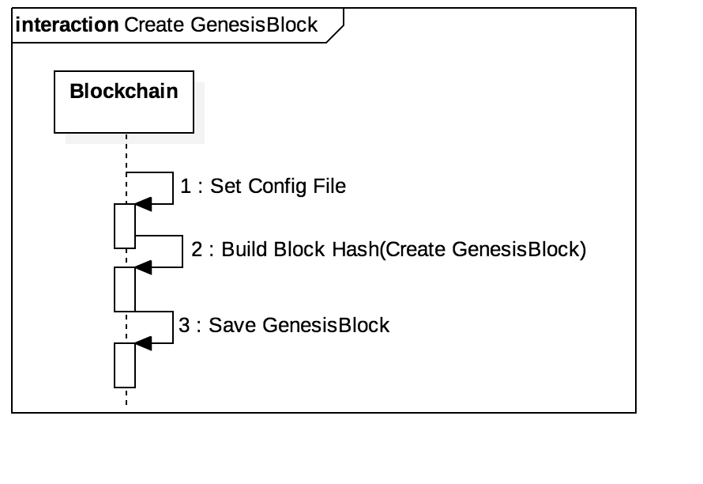

# Architecture of It-chain

## 1.  Development Background and Purpose

Existing blockchain are so large and complex that they have high entry barriers to use in non-IT small and medium communities such small merchant associations. In addition, conventional blockchain such as etherium, bitcoin, and hyperledger fabric and sawtooth are difficult to modify to suit their purposes.

When someone wants to learn more deeply about the blockchain, there is a lot of data related to the general blockchain theory, but there is little data and open source about how to actually implement the block chain using that theory.

To solve these problems, `the project aims to create a lightweight customized blockchain(It-chain)` that can be flexibly modified by small and medium-sized communities to suit their purposes. The It-chain is a blockchain with an easy-to-modify structure, so that people using it-chain can easily modify it according to their needs. In addition, the it-chain is an open-source solution to many problems, such as the PBFT agreement algorithm and the RAFT reader selection algorithm, which are widely known to people through the general theory of block chaining. I would like to present one of them.

It also enables people to understand, not only through code implementation, but also through in-depth documentation. A detailed description of each component is provided in the document and the figure. Because it covers not only the principles of operation but also the various definitions for architecture and development, we can lower the entry barriers of developers who are willing to contribute to open source.

 

## 2. Development Env and Development Language

- Development Env: OSX, Linux

- Development Language: Golang >= 1.9

- Development Requirement: Docker >= 17.12.0 , Rabbitmq >= 3.7.7

   

## 3.  System Architecture

### Architecture of It-chain Network
 It-chain is a private blockchain based on a CA (Certificate Authority). The It-chain network consists of a `leader` and a `general node`, and each node is connected to all nodes participating in the network by `gRPC`. The leader node is responsible for the start of the block generation and the agreement algorithm and is replaced periodically. The remaining general nodes verify and agree on the block created by the reader, sign the transaction received from the client application, and deliver it to the reader. A client application can request any of the It-chain networks.

### Architectuee of It-chain Node

The It-chain node-level architecture model is shown in the figure above. The it-chain consists of six independently operating core components, each communicating via the Asynchronous Message Queue Protocol (AMQP). AMQP is an event bus connector that generates and distributes events for internal core components according to an external message coming into the gateway. Each core component operates by receiving events that it has already registered. A specific implementation of AMQP uses RabbitMQ.

 

The it-chain node is connected to an external network node (another it-chain node or client applications) via two gateway components (Client API Gateway and gRPC Gateway).

- Client Gateway  : It is provided as REST API for client applications (server, mobile app, desktop app, etc).
- gRPC Gateway  :  It is a service for communication between nodes. It handles communication related to the block chain such as block sink, agreement message, and so on.

Each component of the it-chain has its own data for operation (see Micro Service Architecture structure). Therefore, in some cases, the same data can be stored in duplicate in different components, which allows this.

- TxPool component: A component that temporarily stores and manages transactions, and collects transactions that are not agreed upon and stored in the block.
- Consensus component: This is the component responsible for the consensus, and now conforms to the Practical Byzantine Fault Tolerance (PBFT) algorithm.
- BlockChain component: A component that creates, sinks, verifies and manages blocks.
- Ivm component: It is responsible for iCode-related functions which are smart contract of it-chain.

As such, the it-chain is advantageous in that it can be easily modified according to the user's needs because each completely independent component forms a whole system. For example, if you want to change the PBFT agreement algorithm that is currently used in the it-chain, you only need to replace the domain logic of the consensus component. Alternatively, if you want to change the block structure of a block chain, you can satisfy the need by simply replacing the domain logic of the blockchain component.

 

### Consensus

 The consensus component plays a role for the members of the peer-to-peer network to agree on the storage order of the blocks for the blocks generated in the blockchain component. In the It-chain, this consensus process is implemented through the PBFT agreement algorithm, and the leader of the PBFT is selected through the RAFT leader selection algorithm.

The consensus process begins by proposing a block to be agreed upon by the elected leader, and a parliament is formed, which is a set of Representatives participating in the consensus process for the block proposed by the leader. Representatives constituting the parliament are selected among all the nodes constituting the P2P network. Currently, all the nodes at the time of proposing a block are selected as representatives . After the parliament is formed, the consensus sends AMQP through the block consent request event, the block consent completion event, the consensus message (Propose, PreVote, PreCommit). The State API is an API that performs block agreement. When a block agreement is requested, the agreement message is exchanged with another node and agreed. The Election API is an API that selects the leader to start a timer to set a leader candidate or vote for a leader candidate. The Leader API performs functions such as updating the leader.

 

### gRPC-Gateway

gRPC-Gateway is responsible for communication between nodes participating in it-chain network. gRPC-Gateway maintains connections with all nodes in the network through gRPC Bi-stream and manages connections

gRPC-Gateway communicates with another component of the same node using Async Message Queue Protocol (AMQP), and has a Connection API that handles connection related functions and a Message API that processes a message transmission request to other nodes Receive requests and process them. Both the Connection API and the Message API use the gRPC Host service to manage the connection with the node and to send the message to the node

 

### API-Gateway

The API-Gateway handles HTTP requests from clients. Requests from clients are divided into data changes (Create, Update, Delete) and queries. The Query API handler receives a query request and performs a function of retrieving a block, a transaction, an ICode, and a connection from a repository. The API Handler receives the data change request and sends a request to AMQP such as Transaction Submit and ICode Deploy to the corresponding component.  

The AMQP Handler receives the creation, update, and deletion events of Block, Connection, and ICode from other components and stores data for query independently in the DB. The Query API retrieves data from the DB. In this way, the API-Gateway is separated from other components to separate the data inquiry logic and the data change logic.

 

### Blockchain

The blockchain component performs functions such as block creation, storage, and synchronization. AMQP is used to collaborate with various components. Generally, a block is generated by using a transaction received from a transaction pool component (TxPool Component), and a block is transferred to a consensus component for aggrement. After receiving consensus blocks from the consensus component, they are verified and stored.

If it is a leader node, it receives a request from a transaction pool component (TxPool Component), generates a block, and requests a consensus component for a block agreement. When the consensus component completes the agreement, all nodes in the network store the block in the blockchain

The block chain synchronization is a process for making all block nodes in the network equal to each other. When a new node participates in the network, block chain synchronization with other nodes proceeds

### Ivm

The ivm component (ICode Virtual Machine Component) is a component that runs and manages ICode, the smart contract of it-chain. ICode Container Service is used to manage ICode in each independent docker environment, and ICode is deployed from GitHub and GitLab via Git Service. Deploy supports the Git SSH protocol and HTTPS. When deploying using the Git SSH protocol, you can optionally use the SSH key.

Each ICode is assigned an ICode ID by using the Git URL of the ICode and the commit hash of the head when deploying. Therefore, if you deploy the same version ICode in any node, it will have the same ICode ID. When the IVM receives a block commit event of a blockchain component, it executes the ICode of the transactions in the block. Also, ICode is executed to inquire the value of the state by a state query request.

### Txpool

Txpool verifies the submitted transaction and sends a block creation request to the blockchain component if it is a leader node and a transaction to the leader node if it is a normal node . Submitted transactions to the API-Gateway are delivered to Txpool by AMQP and are stored in the Transaction pool after validation by the Transaction API. Two batch threads are executed in Txpool, each of which takes a transaction from the transaction pool and sends a request to the leader node for transmission or block generation

# 4. Major Activities of the project

## Make block

In the It-chain, block creation is divided into Genesis Block creation and general Normal Block(not initially created) creation.

When the node first drives it-chain, a Genesis Block is created. And, when the it-chain runs, all nodes generate the initial block.

The Genesis Block is generated based on the Config file created by the user. The Config file consists of Organization, Network ID, and Creator. Before running the it-chain, the user can set the value of the Genesis Block by modifying this file.

Genesis Blocks can be seen as the admission ticket for a node to join the network, because if you do not set the value, you can not have the same block chain even if you create the network. Creation of the Genesis Block is completed by encrypting the set values and creating a block hash value. The Genesis Block is stored immediately after being created without consensus.

On the other hand, when generating a block other than a genesis block, a block creation request is received from a TxPool component, and only a leader node generates a block. That is, when a client requests a transaction to a node in an it-chain network, the node delivers a transaction to the leader node. And when the TxPool component of the leader node that has received the transaction requests the blockchain component to generate the block, ProposedBlock is created. The process of creating a ProposedBlock is to set the necessary values ​​for block creation. Typically, a block hash value of the last block in the block chain is designated as a previous block hash value of the block to be generated, or a value of 1 is added to the height value of the last block, (Height). After this, the set values, the transaction, and the timestamp are encrypted to generate a block hash value. Then, the creation of the block is completed. Blocks are generated and sent to the consensus component for agreement with other nodes.

## Storing blocks(data)

It-chain uses Leveldb, Google's open source key-value database to store blocks.

This allows DB input / output functions such as reading the related block with the transaction ID, block height, and block hash value after the block is inserted into the key value DB.

At this time, the data is saved according to the path set in the Config file.

We have also diversified key-value pairs in order to be able to retrieve the desired value with various key values.

It distinguishes between multiple key-value pairs by prefixing the name of the DB with a key.

| DB Name      | Key            | Value            | Description                  |
| ------------ | -------------- | ---------------- | ---------------------------- |
| block_hash   | BlockHash      | Serialized Block | Save block with block-hash   |
| block_number | BlockNumber    | Block Hash       | Save block with block-number |
| util         | Predefined Key | Depends on Key   | Multiple usage               |

The block hash database (block_hash DB) is a basic DB and stores the block hash that has been confirmed through agreement with other nodes as a key. The block number database (block_number DB) is a DB that enables the block to be found based on the unique number assigned to the block. So, instead of storing the block, we store the block hash.Util DB is a util DB which complements other DBs. It is used when searching for the block to which the transaction belongs, when searching for the last block in a block chain, and so on. Util DB contains things such as the value of the transaction's ID as key and the value of the hash of the block to which the transaction belongs, or the last block created with a predefined key called "last_block".

The point at which the block is stored is after the block has been agreed upon by the other nodes. In order to store the blocks in the DB, various verification processes must be performed. First, it verifies that the last block in the DB (block chain) and the block to be stored are chained. That is, the value of the previous block hash of the block to be stored is compared with the value of the block hash of the last block to confirm that they are the same. Second, check whether there is a problem with the block hash value of the block to be stored. That is, the data of the block to be stored is encrypted to create a new hash value, and it is checked whether the new hash value is equal to the block hash value of the block to be stored. Third, check whether the transactions inside the block are well encrypted. Create a new hash value for the transactions and compare it with the stored hash value. After the above verification process, the block is stored in the DB.

### Block consensus

The it-chain uses PBFT as the consensus algorithm.

PBFT is a consensus algorithm that allows all nodes participating in the system to successfully negotiate even if there is a Byzantine node that does not perform the promised behavior in the network.

PBFT has the advantage of speed in terms of speed, but since it has to communicate with all the nodes participating in the agreement, there is a disadvantage that the communication cost increases and the number of nodes is limited as the number of nodes increases.

However, the it-chain is a private block chain, so we use PBFT because of the small number of nodes.

The process of the PBFT algorithm is as follows.

Unlike the existing PBFT algorithm, only the leader can generate and propose a block in It-chain. Therefore, there is no Request or Response process in existing PBFT. The PBFT process of It-chain is as follows.

1. The leader's Consensus Component receives a request to block from the BlockChain Component.
2. The leader chooses a representative to agree from the request, and creates a State (Consensus) through the Proposed block.
3. The leader broadcasts Propose Message to all Representatives.
4. Representatives who receive the Propose Message create a State (Consensus) from each received Message. Then broadcast the Prevote Message to the Representatives.
5. The Representative shall broadcast a Precommit Message to the Representatives when they receive a ⅓ + one Prevote Message of the total Representative number.
6. When each Representative receives a ⅓ + one PreCommit message of the total Representative number, it issues a Block Confirm Event and deletes the State (Consensus).

### Leader election

In the it-chain PBFT algorithm, all blocks are generated at the leader node, so selection of the leader is very important.

1. Set up and operate a timer of any value between 150 ms and 300 ms on all nodes.
2. First, the node that has finished the timer is called the leader candidate (CANDIDATE) and requests RequestVoteMessage to the remaining nodes to vote on it.

3. The other nodes that received the RequestVoteMessage initialize their timer  if their timer still has remaining time ,and set the node that sent it as a candidate. Afterwards, we send VoteMessage to the node and vote. Then, it initializes its own timer and activates the timer again. The important point here is that if the node that received the RequestVoteMessage is already a voting node, it will specify its number of votes to participate in by increasing its Term immediately before voting. This allows all nodes to participate in only one vote in a single term.

4. If the node that requested the leader vote in step 1 receives a vote for all other nodes, it declares that the node is a leader by sending an UpdateLeaderMessage to the remaining nodes.

5. When the voting node receives an UpdateLeaderMessage, it recognizes and changes the leader if it matches the CANDIDATE that it voted for.

If the timer of two nodes ends at the same time in step 1, two RequestVoteMessages will be delivered. If the node that received the RequestVoteMessage has already voted, it is going to have a higher term than the requesting node. The voting request is then abandoned and the leader is not elected. In this case, the timer with the shortest time among the timers for all the nodes again requests the vote first, and new leader selection is started. This process is repeated until the entire node is elected to reach a consensus leader.

### Block Chain Synchronization

Block Chain Synchronization (Synchronize) is the process of making a block chain of a certain node equal to a block chain of any node in the network. In other words, through a synchronization process, a specific node can acquire a representative value (Seal), a representative value of a previous block (PrevSeal), a transaction collection (TxList), a transaction representative value (TxSeal), a block generation time (TimeStamp) ), The length of the block chain (Height), and so on. The point of synchronizing is when the new node joins the it-chain network. Once the new node has established a connection with all the nodes in the it-chain network, it starts to synchronize.

In the process of synchronization, first check whether block chains of any nodes in the network are the same or not. If synchronization is needed, all blocks that are not held by a particular node are received from an arbitrary node and are stored in a block chain in order to construct the same block chain.

During the synchronization process, an exceptional situation may occur in which a newly agreed block is created. The It-chain solves this exception through a structure called a block pool. If the agreed-upon block is delivered from the leader node during Synchronize, it is stored in the block pool instead of being stored directly in the repository. Block pools are used to temporarily store the agreed blocks in case they can not be stored immediately. When synchronization is complete, take the block from the block pool and store it in the block chain.

### ICode Deploy

In order to execute ICode in It-chain, it is necessary to perform Deploy process first. ICode is deployed as git. So, it supports ssh git protocol and https, and supports encryption through ssh key at this time.

The above figure is a sequence diagram of ICode. The order in which ICode is deployed is as follows.

1. The user requests the deploy by putting the key in the git url and selection.
2. In It-chain, make sure the corresponding git url is valid and get ICode through clone.
3. Create an independent environment for the ICode through the Docker.
4. Create the ICode ID using the url of the ICode and the commit hash of head.
5. Returns ID of successfully deployed ICode to user.

### Running ICode

In It-chain, ICode is executed via IVM by invoke and query request. Invoke is a task that requests execution of a function with a change in data. Invoke is executed by Transaction, and Transaction contains ICode ID, function name, and parameter value to be executed. Query is a function execution inquire task that query data.

1. When the blocks are agreed and registered, the transactions in the block are sequentially fetched.
2. Execute in IVM using ICodeID, function name and parameters specified in the transaction.
3. The IVM uses the ICodeID to find the container container corresponding to ICode.
4. Run ICode by passing the function name and parameters to the appropriate container.

Since the query is not executed by Transaction, it is independent of the time point of the block sum.
It is executed by Api-gateway or CLI by necessity and its order is as shown below.

1. Receive ICode Query request by Api-gateway or CLI.
2. Execute in IVM using corresponding ICode ID, function name, and parameters.
3. The IVM uses the ICodeID to find the container container corresponding to ICode.
4. Run ICode by passing the function name and parameters to the appropriate container.
5. Pass the execution result value (value inquired by the query request) of ICode to Api-gateway or CLI.
