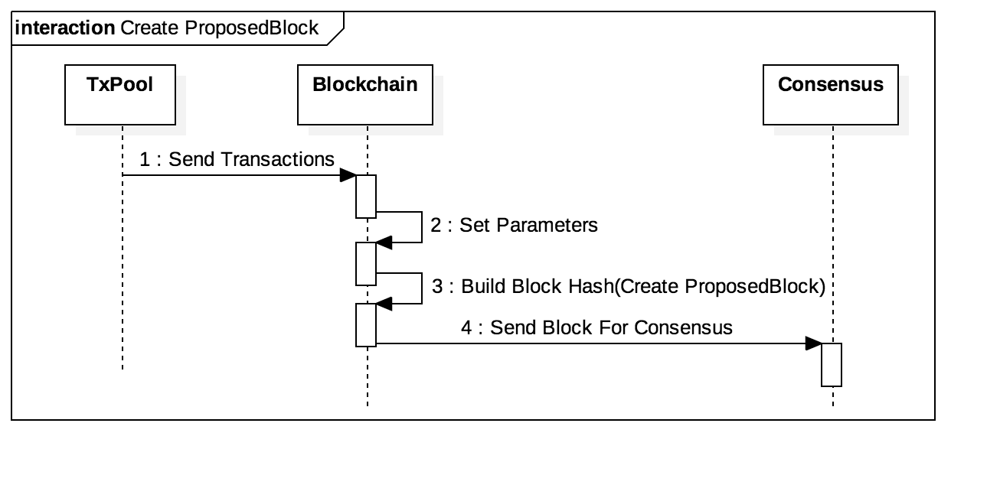
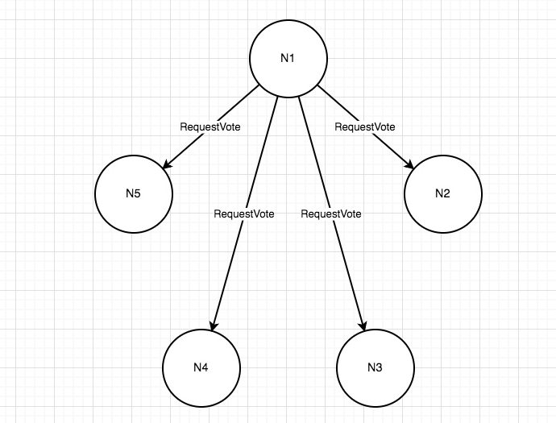
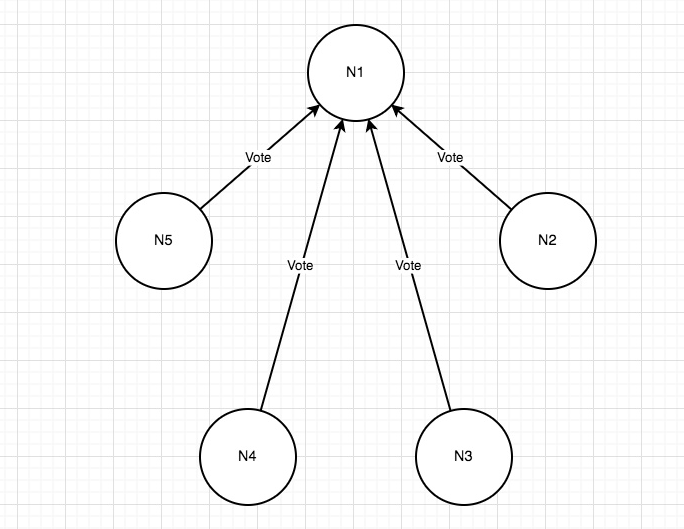
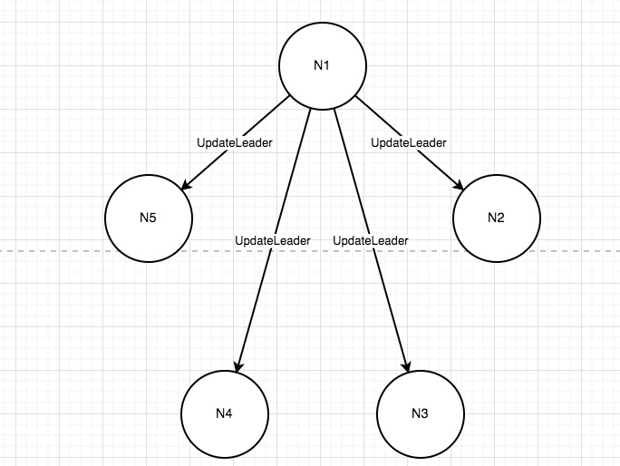
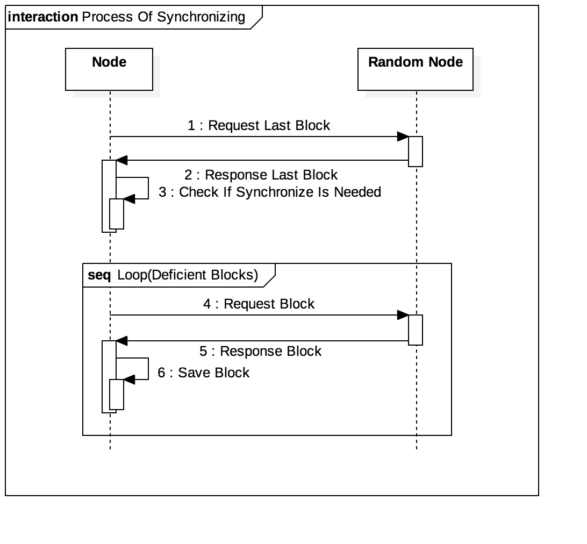
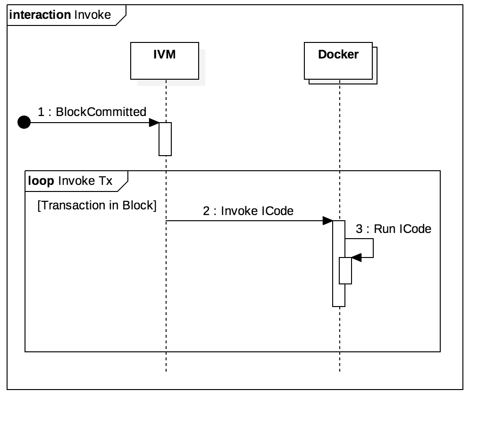
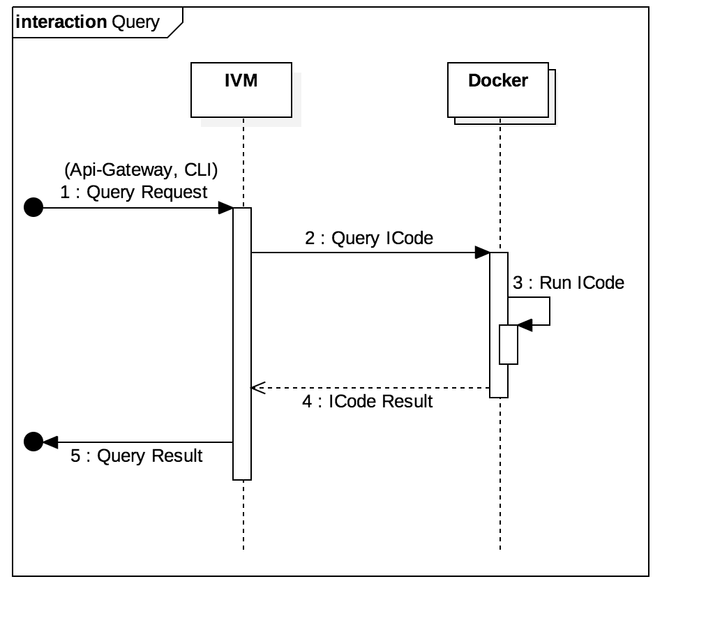

# It-chain 아키텍처 문서

## 1. 개발 배경 및 목적

기존 블록체인은 그 규모가 방대하고 복잡하여 지역사회, 소규모 상인연합과 같은 비IT 중소규모 커뮤니티에서 사용하기에 높은 진입장벽을 갖고 있다. 또한 이더리움, 비트코인, 하이퍼레저와 같은 기존의 블록체인은 자신들의 목적에 맞춰 수정하여 사용하기에 어려움이 있다. 
그리고 누군가가 블록체인에 대해서 심도 있게 학습하고자 할 때 일반적인 블록체인 이론과 관련된 자료는 많지만 그 이론을 이용해서 실제로 어떻게 블록체인을 구현할 지에 대해서 자세히 알려주는 자료와 오픈소스는 거의 없다.
  
본 프로젝트는 이러한 문제점들을 해결하기 위해서 중소규모 커뮤니티에서 유연하게 수정하여 자신들의 목적에 맞게 활용할 수 있는 경량 맞춤형 블록체인 It-chain을 만든다. It-chain은 수정 용이한 구조를 가진 블록체인으로써 it-chain을 사용하는 사람들이 각자의 필요에 따라서 쉽게 수정할 수 있게 만들고자 한다.
또한 블록체인의 핵심이라고 할 수 있는 PBFT 합의 알고리즘이나 RAFT 리더 선출 알고리즘과같이 일반적인 이론을 통해서는 사람들에게 널리 알려져있지만 실제로 그것을 어떻게 구현할지 고민이 필요한 부분에 대해서 it-chain은 오픈소스로써 수 많은 해결책 중 한 가지를 제시하고자 한다.
  
또한, 코드 구현 뿐만 아니라 깊이 있는 문서화를 통해 사람들로 하여금 이해를 도울 수 있도록 한다. 컴포넌트별 자세한 설명을 문서와 그림을 통해 제공한다. 동작원리 뿐만 아니라 아키텍처, 개발을 위한 여러 정의까지 모두 정리하여 아우르고 있기 때문에 오픈소스에 기여하고자 하는 개발자의 진입 장벽을 조금이라도 낮출 수 있을 것이다.

## 2. 개발 환경 및 개발 언어

- 개발 환경: OSX, Linux
- 개발 언어: Golang 1.9 이상
- 개발 요구 사항: Docker 17.12.0이상, Rabbitmq 3.7.7이상

## 3. 시스템 구성 및 아키텍처

### It-chain Network 아키텍처

It-chain은 CA(Certificate Authority)를 기반으로한 프라이빗(Private) 블록체인(Blockchain)이다. It-chain 네트워크는 리더(Leader)와 일반 노드로 구성되며, 각 노드들은 네트워크에 참여한 모든 노드들과 gRPC로 연결되어 있다. 이 때 리더 노드는 블록 생성과 합의 알고리즘의 시작을 담당하며 주기적으로 교체된다. 나머지 일반 노드들은 리더가 생성한 블록을 검증 및 합의 하며, 클라이언트 어플리케이션(Client Application)으로 부터 전달받은 트랜잭션(Transaction)에 서명(Sign)하여 리더에게 전달한다. 클라이언트 어플리케이션(Client Application)은 It-chain 네트워크 중 임의의 노드에게 요청할 수 있다.

### It-chain Node아키텍처

It-chain 노드 수준 아키텍처 모델은 위 그림과 같다. it-chain  은 6개의 독립적으로 동작하는 핵심 컴포넌트(Component)들로 구성되어 있으며, 각각은 AMQP(Asynchronous Message Queue Protocol)를 통해 커뮤니케이션한다. AMQP는 이벤트 버스 커넥터(Event Bus Connector)이며, 게이트웨이로 들어온 외부 메세지(Message)에 맞춰 내부 핵심 컴포넌트들을 위한 이벤트(Event)를 생성하여 배포한다. 각 핵심 컴포넌트들은 자신들이 이미 등록한 이벤트를 받아서 동작한다. AMQP의 구체적인 구현체는 RabbitMQ  를 사용한다.

it-chain 노드는 2개의 게이트웨이 컴포넌트(Client API Gateway 와 gRPC Gateway)를 통해 외부 네트워크 노드(다른 it-chain  노드 또는 클라이언트 어플리케이션들)와 연결된다.

- Client Gateway  : 클라이언트 어플리케이션(서버, 모바일 앱, 데스크톱 앱 등)들을 위한 API로 REST로 제공된다.
- gRPC Gateway  : it-chain 노드 간의 커뮤니케이션을 위한 서비스로, 블록 싱크, 합의 메세지 등과 같이 블록체인에 관련된 커뮤니케이션을 처리한다.
  
it-chain  의 각 컴포넌트는 동작에 필요한 데이터를 직접 갖고 있다 (Micro Service Architecture 구조에서 참조). 그렇기 때문에 경우에 따라 같은 데이터가 서로 다른 컴포넌트에 중복되어 저장될 수 있으며, 이를 허용한다.    

- TxPool 컴포넌트: 트랜잭션(Transaction)을 임시로 저장하고 관리하는 컴포넌트로, 합의되어 블록에 저장되지 않은 트랜잭션들을 모아둔다.
- Consensus 컴포넌트: 합의를 담당하는 컴포넌트이며, 현재는 PBFT(Practical Byzantine Fault Tolerance) 알고리즘을 따른다.
- BlockChain 컴포넌트: 블록을 생성, 싱크, 검증하고 관리하는 컴포넌트이다.
- Ivm 컴포넌트: it-chain의 스마트 컨트랙트인 iCode 관련 기능을 담당한다.

이와 같이 it-chain은 각각의 완전히 독립적인 컴포넌트들이 모여서 전체 시스템을 구성하기 때문에 사용자의 필요에 따라서 수정이 용이하다는 장점이 있다. 예를 들어 현재 it-chain에서 사용하고 있는 PBFT 합의 알고리즘을 바꾸고 싶은 경우 컨센서스 컴포넌트(Consesus Component)의 도메인 로직만 교체하면 된다. 혹은 블록체인의 블록 구조를 바꾸고 싶은 경우에는 블록체인 컴포넌트(Blockchain Component)의 도메인 로직만 교체하면 그 니즈를 충족시킬 수 있다.

### Consensus

컨센서스 컴포넌트(Consesus Component)는  블록체인 컴포넌트(Blockchain Component)  에서 생성된 블록(Block)에 대해, P2P 네트워크의 구성원들이 블록의 저장 순서에 대해 합의하는 역할을 수행한다. It-chain 에서 이러한 합의 과정은 PBFT 합의 알고리즘을 통해 구현되며, PBFT의 리더는 RAFT 리더 선출 알고리즘을 통해 선출된다.

합의 과정은 선출된 리더가 합의하고자 하는 블록을 제안(Propose) 함으로써 시작되며, 리더가 제안한 블록에 대한 합의 과정에 참여하는 의원(Representative) 의 집합인 의회(Parliament) 가 구성된다. 의회를 구성하는 위원(Representative) 들은 P2P 네트워크를 구성하는 전체 노드들 중 선발되는데, 현재는 블록을 제안(Propose) 하는 시점의 모든 노드들이 선발되는 것을 기본으로 한다. 의회가 구성되고 난 뒤 컨센서스(Consensus)는 블록 합의 요청 이벤트, 블록 합의 완료 이벤트, 합의 메시지(Propose, PreVote, PreCommit) 등을 AMQP를 통해 주고 받는다. State API는 블록 합의를 수행하는 API로, 블록 합의를 요청받으면 합의 메시지를 다른 노드와 주고 받으며 합의를 진행한다. Election API는 리더 선출을 담당하는 API로 리더 후보를 정할 타이머를 시작하거나 리더 후보에 대한 투표(Vote)를 수행한다. Leader API는 리더 업데이트 등의 기능을 수행한다.

### gRPC-Gateway

gRPC-Gateway는 it-chain 네트워크에 참여하는 노드 사이의 통신을 담당한다. gRPC-Gateway는 gRPC Bi-stream을 통해 네트워크의 모든 노드와 커넥션(Connection)을 유지하며, 커넥션(Connection)을 관리한다.

gRPC-Gateway는 같은 노드의 다른 Component와 AMQP(Async Message Queue Protocol)를 사용하여 통신하며, 커넥션(Connection) 관련 기능을 처리하는 Connection API와 다른 노드에게 메세지(Message) 전송요청을 처리하는 Message API가 요청을 받아 처리한다. Connection API와 Message API 모두 gRPC Host service를 사용하여 노드와의 커넥션(Connection)을 관리, 노드에게 메세지(Message)전송 기능을 수행한다.

### API-Gateway

API-Gateway는 클라이언트(Client)로부터의 HTTP 요청을 처리한다. 클라이언트(Client)의 요청은 크게 데이터 변경(Create, Update, Delete)과 조회(Query)로 나뉘어 진다. Query API Handler는 조회(Query)요청을 받아 리포지토리(Repository)로 부터 블록(Block), 트랜잭션(Transaction), ICode, 커넥션(Connection)을 조회하는 기능을 수행한다. API Handler는 데이터 변경요청을 받아 해당 컴포넌트에게 트랜잭션 전송(Transaction Submit), ICode 디플로이(ICode Deploy)같은 요청을 AMQP로 전달한다.

AMQP Handler는 다른 컴포넌트들로 부터 블록(Block), 커넥션(Connection), ICode의 생성, 업데이트, 삭제 이벤트를 받아 독립적으로 조회를 위한 데이터를 DB에 저장하고, Query API는 해당 DB로부터 데이터를 조회하여 반환한다. 이와 같이 API-Gateway를 다른 컴포넌트들과 나누어 데이터의 조회 로직과 데이터의 변경 로직을 분리시켰다.

### Blockchain

블록체인 컴포넌트(Blockchain Component)는 블록의 생성, 저장, 블록체인 동기화 등의 기능을 수행한다. AMQP를 통해 여러 컴포넌트와 협업하며 기능을 수행하는데, 개략적으로 트랜잭션 풀 컴포넌트(TxPool Component)로부터 받은 트랜잭션(Transaction)을 활용하여 블록을 생성하고, 합의를 위해 블록을 컨센서스 컴포넌트(Consensus Component)에 전달한다. 이후 컨센서스 컴포넌트(Consensus Component)로부터 합의를 마친 블록을 전달받아, 검증 과정을 거친 후 저장한다.

자신이 리더 노드일 경우, 트랜잭션 풀 컴포넌트(TxPool Component)로부터 요청을 받아 블록을 생성하고, 컨센서스 컴포넌트(Consensus Component)에 블록의 합의를 요청한다. 컨센서스 컴포넌트(Consensus Component)에서 합의를 완료하면, 네트워크 내 모든 노드는 해당 블록을 블록체인에 저장한다.

블록체인 동기화는 네트워크 내 모든 노드의 블록체인을 동일하게 하기 위한 과정으로, 새로운 노드가 네트워크에 참여할 시 다른 노드와의 블록체인 동기화를 진행한다.

### Ivm

vm 컴포넌트 (ICode Virtual Machine Component) 는 it-chain의 스마트 컨트랙트인 ICode를 실행시키고 관리하는 컴포넌트이다. ICode Container Service를 이용하여 ICode들을 각각의 독립된 도커(Docker)환경에서 관리하고, Git Service를 통해서 ICode를 GitHub, GitLab으로부터 디플로이(Deploy)한다. 디플로이(Deploy)는 Git SSH 프로토콜과 HTTPS 를 지원한다. Git SSH프로토콜을 이용하여 디플로이(Deploy)할때는 선택적으로 SSH 키(Key)를 이용할 수 있다.

각각의 ICode는 디플로이(Deploy) 할 때 해당 ICode의 Git URL과 헤드(Head)의 커밋 해시(commit hash)를 이용하여 ICode 아이디를 부여한다. 따라서 어느 노드에서 실행시켜도 같은 버전 ICode를 디플로이(Deploy) 한다면 같은 ICode 아이디를 갖게된다.  
IVM은 블록체인 컴포넌트(Blockchain Component)의 블록 커밋(Block Committed) 이벤트를 받으면 해당 블록 내 트랜잭션(Transaction)들의 ICode를 실행시킨다. 또한 상태 쿼리(State Query) 요청에 의해 현재 상태(State)의 값을 조회하기 위해 ICode를 실행 시킨다.

### Txpool

Txpool은 제출(Submitted)된 트랜잭션(Transaction)을 검증하고, 자신이 리더 노드일 경우 블록체인 컴포넌트(Blockchain Component)에게 블록 생성 요청을, 일반 노드일 경우 리더 노드에게 트랜잭션(Transaction)을 전달해주는 기능을 수행한다. API-Gateway로 제출(Submitted)된 트랜잭션(Transaction)은 AMQP로 Txpool에 전달되고, Transaction API에 의해 검증 후, Transaction pool에 저장된다. Txpool에는 2개의 배치 스레드(Batch Thread)가 실행되고 있는데, 각각은 Transaction pool에서 트랜잭션(Transaction)을 가져와 리더 노드에게 전송 혹은 블록 생성 요청을 한다.

## 4. 프로젝트 주요기능

### 블록 생성

It-chain에서 블록 생성은 제네시스 블록(Genesis Block) 생성과 최초가 아닌 일반 블록(Block) 생성으로
나뉜다. 제네시스 블록(Genesis Block)을 생성하는 시점은 노드가 it-chain을 처음 구동하는 때이고, 모든
노드가 it-chain 구동시 최초 블록을 생성한다. 제네시스 블록(Genesis Block)은 사용자가 작성한 Config
파일을 토대로 생성된다. Config 파일은 기관(Organization), 네트워크 정보(Network ID), 생성자(Creator)
등으로 이루어져 있고, 사용자는 it-chain을 구동하기 전 이 파일을 수정하여 제네시스 블록(Genesis
Block)의 값을 세팅할 수 있다. 설정값을 맞춰주지 않으면 네트워크를 만들더라도 동일한 블록체인을 가질
수 없기 때문에, 제네시스 블록(Genesis Block)은 노드가 네트워크에 참여하기 위한 입장권의 역할을
한다고 볼 수 있다. 세팅된 값들을 암호화하여 블록 해시(Block Hash)값을 만들어주면, 제네시스 블록(Genesis Block) 생성이 완료된다. 제네시스 블록(Genesis Block)은 생성된 이후 합의를 거치지 않고
바로 저장된다.

한편, 제네시스 블록(Genesis Block)이 아닌 블록(Block)을 생성하는 시점은 TxPool 컴포넌트로부터 블록
생성 요청을 받았을 때이고, 리더 노드만이 블록(Block)을 생성한다. 즉, 클라이언트(Client)가 it-chain
네트워크 내 임의의 노드에게 Transaction을 요청하면 임의의 노드는 리더 노드에게 Transaction을
전달하고, Transaction을 전달받은 리더 노드의 TxPool 컴포넌트가 Blockchain 컴포넌트에 블록 생성을
요청할 때 ProposedBlock을 생성한다. ProposedBlock을 생성하는 과정은 먼저 블록체인 내 마지막 블록의
블록 해시(Block Hash) 값을 생성할 블록의 이전 블록 해시(Block Hash)값으로 지정하고, 마지막 블록의
고유 번호(height) 값에 1을 더한 값을 생성할 블록의 고유 번호(height)로 지정하는 등 블록 생성에 필요한
값들을 세팅해준다. 이 후, 세팅된 값들과 트랜잭션(Transaction), 타임스탬프(Timestamp) 등을
암호화하여 블록 해시(Block Hash)값을 만들어주면, 블록(Block) 생성이 완료된다. 블록(Block)은 생성된
이후 다른 노드들과의 합의를 위해 컨센서스 컴포넌트(Consensus Component)로 전달된다.

### 블록(데이터) 저장

It-chain은 블록을 저장하기 위해 구글의 오픈소스 키 벨류 데이터베이스(Key Value DB)인 Leveldb를
사용한다. 이를 통해서 블록을 키 벨류 데이터베이스(Key Value DB)에 쓰고, 트랜잭션 아이디(ID), 블록
높이(Height), 블록 해시(Hash) 값 등으로 관련 블록을 읽는 등의 DB 입출력 기능을 제공한다. 이 때
데이터는 Config 파일에 설정된 경로에 저장되는데, 여러가지의 키(key)값으로 원하는 값(value)을 조회할
수 있게 하기 위해 키-벨류(key-value)쌍을 다양화하였다. DB의 이름에 키(key)의 접두사를 붙여 여러
키-벨류(key-value)쌍을 구분하고 있다.

| DB Name      | Key            | Value            | Description                  |
| ------------ | -------------- | ---------------- | ---------------------------- |
| block_hash   | BlockHash      | Serialized Block | Save block with block-hash   |
| block_number | BlockNumber    | Block Hash       | Save block with block-number |
| util         | Predefined Key | Depends on Key   | Multiple usage               |

블록 해시 데이터베이스(block_hash DB)는 가장 기본이 되는 DB로, 다른 노드들과의 합의 과정을 통해
검증(confirm)된 블록 자체가 블록 해시를 key로 저장된다. 블록 넘버 데이터베이스(block_number DB)는
블록에 부여된 고유 숫자를 기반으로 블록을 찾을 수 있게 하는 DB인데, value에 블록 자체를 저장하지
않고, 블록 해시를 저장한다. Util DB는 다른 DB들을 보완하는 util 성격의 DB로, 트랜잭션이 속한 블록을
찾을 때, 블록체인의 마지막 블록을 찾을 때 등에 활용된다. util DB에는 트랜잭션의 ID를 key로 하고 해당
트랜잭션이 속한 블록의 해시 값을 value로 하는 값, “last_block”이라는 미리 정의된 key로 마지막으로
생성된 블록 자체등이 들어간다.

블록을 저장하는 시점은 다른 노드들과 블록을 합의하고 난 후이다. 블록을 DB에 저장하기 위해서는 여러
검증 과정을 거쳐야 한다. 첫째, DB(블록체인) 내 마지막 블록과 저장할 블록이 chain 되는지를 검증한다.
즉 저장할 블록의 ‘이전 블록 해시’값과 마지막 블록의 ‘블록 해시'값을 비교하여 같은 지 확인한다. 둘째,
저장할 블록의 블록 해시값에 이상이 없는지 확인한다. 즉, 저장할 블록의 데이터를 암호화하여 새로운
해시 값을 만들고, 저장할 블록의 블록 해시값과 같은지 확인한다. 셋째, 블록 내부의 트랜잭션들이 잘
암호화되어있는 지 확인한다. 트랜잭션들의 해시 값을 새로 만들고, 저장되어 있는 해시 값과 비교한다.
일련의 검증 과정 후 블록을 DB에 저장하게 된다.

### 블록 합의

it-chain에서는 합의 알고리즘으로 PBFT를 사용한다. PBFT는 네트워크 안에서 약속된 행동을 하지 않는
비잔틴 노드가 존재하여도 해당 시스템 안에서 참여한 모든 노드가 성공적으로 합의를 이룰 수 있는 합의
알고리즘이다. PBFT는 속도면에서 빠르다는 장점이 있지만 합의에 참가하는 모든 노드들과의 통신을
해야하기 때문에, 노드가 늘어날 수록 Communication 비용이 증가하여 노드 수의 한계가 있다는 단점이
있다. 하지만 it-chain은 프라이빗 블록체인(private blockchain) 으로 노드의 수가 많지 않기 때문에 PBFT를
사용하였다. PBFT 알고리즘의 과정은 다음과 같다.

It-chain 에서는 기존 PBFT 알고리즘과는 다르게 리더만이 블록을 생성하고 제안할 수 있다. 따라서 기존의
PBFT에 있는 Request, Response 과정이 없다. It-chain의 PBFT 과정은 다음과 같다.

1. 리더의 Consensus Component는 BlockChain Component로 부터 블록을 합의하라는 Request를
   받는다.
2. 리더는 Request로 부터 합의할 대표자(Representative)를 선출하고, Propose된 블록을 통해
   State(Consensus)를 생성한다.
3. 리더는 모든 Representative에게 Propose Message를 브로드캐스트한다.
4. Propose Message를 받은 Representatives는 각자 받은 Message로부터 State(Consensus)를
   생성한다. 그 다음 Prevote Message를 Representatives에게 브로드캐스트한다.
5. Representative 는 각자 전체 Representative 수의 ⅓ + 1 개의 Prevote Message를 받았을 경우
   Precommit Message를 Representatives에게 브로드캐스트한다.
6. Representative는 각자 전체 Representative 수의 ⅓ + 1 개의 PreCommit Message를 받았을 경우
   Block Confirm Event를 발행하고, State(Consensus)를 삭제한다.

### 리더 선출

it-chain의 PBFT 알고리즘에서 모든 블록의 생성은 리더 노드에서 이루어지게 되므로, 리더의 선정은 매우
중요하다.

리더의 선정에 있어 가장 중요하게 다루어야 할 부분중 하나는 바로 모든 노드가 같은 리더에 대해 합의를
이루고 이를 공유하도록 하는 것이다. 이를 위해 It-chain 에서는 리더 선출 알고리즘으로 RAFT 알고리즘에
기반을 둔 알고리즘을 차용 하였으며, 그 과정은 다음과 같다.

1. 모든 노드에서 150ms ~ 300ms 사이의 임의의 값의 타이머를 설정하여 작동시킨다.
2. 제일 먼저 타이머가 종료된 노드가 스스로 리더 후보( CANDIDATE) 가 되고 다른 노드들에게
   RequestVoteMessage 를 전달하여 자신에게 투표를 하도록 요청한다.
   
   

3. RequestVoteMessage 를 받은 다른 노드들은 만약 자신의 타이머가 아직 잔여시간이 남았다면
    자신의 타이머를 초기화하고 송신한 노드를 후보자로 정한 뒤 해당 노드에게 VoteMessage 를
    전달함으로써 투표하고, 자신의 타이머를 초기화하여 다시 타이머를 작동시킨다. 이때 중요한
    사항은 RequestVoteMessage 를 받은 노드가 이미 투표를 한 노드라면 투표 직전에 자신의 Term
    을 증가시켜 몇회차의 투표에 참여하는 것인지를 명시하는 것이다. 이를 통해 모든 노드는 한번의
    Term 에서 단 한번만 투표에 참여하게 한다.

    

4. 만약 1번 과정에서 리더 투표를 요청한 노드가 다른 모든 노드에게 투표를 받으면 해당 노드가
   리더가 되는 것을 선언하고 나머지 노드들에게 UpdateLeaderMessage 를 보냄으로써 자신이
   리더임을 알린다.

    

5. 투표에 참여한 노드가 UpdateLeaderMessage 를 받으면 자신이 투표했던 CANDIDATE와
   비교하여 일치하면 리더를 인정하고 노드의 리더를 변경한다.

만약 1번 과정에서 동시에 두명의 노드의 타이머가 종료되면 두개의 RequestVoteMessage가 전달될
것이며 RequestVoteMessage를 받은 노드가 이미 투표를 하였다면 요청을 하는 노드보다 높은 Term을
가지게 될 것이고, 해당 투표 요청은 무산되어 리더가 선출되지 않게 된다. 이 경우 다시 모든 노드들에
대한 타이머 중에서 가장 짧은 시간을 가진 타이머가 먼저 투표 요청을 함으로써 새로운 리더선출이
시작된다. 이 과정은 전체 노드가 합의를 이룰 수 있는 리더가 선출될 때까지 반복된다.

### 블록체인 동기화

블록체인 동기화(이하 Synchronize)는 특정 노드의 블록 체인을 네트워크 내 임의의 노드의 블록 체인과
동일하게 만드는 과정을 의미한다. 즉 Synchronize 과정을 통해 특정 노드는 모든 블록에 대하여
대표값(Seal), 이전 블록의 대표값(PrevSeal), 트랜잭션 모음(TxList), 트랜잭션 대표값(TxSeal), 블록 생성
시각(TimeStamp), 생성자(Creator), 블록 체인의 길이(Height) 등의 블록 체인과 관련된 모든 정보들을
다른 노드의 것과 동일하게 한다. Synchronize를 하는 시점은 새로운 노드가 it-chain 네트워크에 참여할
때이다. 새로운 노드가 it-chain 네트워크 내 모든 노드들과 Connection을 형성하고 나면, Synchronize를
시작한다.

Synchronize의 과정은 먼저 네트워크 내 임의의 노드의 블록체인이 동일한 지 비교하여, Synchronize가
필요한 지 점검한다. Synchronize가 필요하다면, 특정 노드가 보유하지 않은 모든 블록을 임의의
노드로부터 받아와 순서대로 블록체인에 저장하여, 동일한 블록체인을 구축한다.

Synchronize의 과정 중에 새롭게 합의된 블록이 생성되는 예외적인 상황이 발생할 수 있는데 It-chain은
이런 예외 상황을 블록 풀(Block Pool)이란 구조를 통해서 해결하였다. Synchronize 중에 리더 노드로부터
합의된 블록이 전달되면 이는 저장소에 바로 저장하는 것이 아니라 블록 풀에 저장한다. 블록 풀은 이렇게
합의된 블록들을 바로 저장할 수 없는 경우 임시로 보관하는 역할을 한다. Synchronize가 완료되면 블록
풀에서 블록을 가져와 블록체인에 추가로 저장한다.

### ICode Deploy

It-chain 에서 ICode를 실행하기 위해서는 먼저 Deploy하는 과정이 필요하다. ICode 는 git을 통해
Deploy된다. ssh git 프로토콜과 https 를 지원하며 이때 ssh Key를 통해 암호화를 지원한다.

위 그림은 ICode의 Sequence Diagram이다. ICode가 Deploy되는 순서는 다음과 같다.

1. 유저가 git url과 선택에 의해 key를 넣어 deploy를 요청한다.
2. It-chain 에서는 해당 git url이 유효한지 확인하고 clone을 통해 ICode를 받는다.
3. Docker를 통해 해당 ICode를 위한 독립적인 환경(Container)을 만들어 준다.
4. 해당 ICode의 url과 head 의 commit hash를 이용하여 ICode ID를 만들어 준다.
5. 유저에게 성공적으로 Deploy 된 ICode 의 ID를 반환하여 준다.

### ICode 실행

It-chain 에서 ICode는 Invoke 와 Query 요청에 의해 IVM을 통해 실행된다. Invoke는 데이터의 변경이 있는
함수를 실행 요청하는 작업을 말한다. Invoke는 Transaction에 의해 실행되며 Transaction에는 실행시킬
ICode ID, 함수이름, 파라미터 값이 들어있다. Query는 데이터를 조회하는 함수 실행 요청 작업을 말한다.
Query요청은 Api-gateway 또는 CLI(Command Line Interface)를 통해 요청할 수 있다. 따라서 Invoke는 블록이 합의 되어 추가될때 실행되고, 순서는 아래 그림과 같다.

1. 블록이합의되어 등록되면 블록내의 트랜젝션을 순차적으로 꺼내온다.
2. 트랜젝션에 명시된 ICodeID 와 함수이름, 파라미터를 이용하여 IVM에서 실행한다.
3. IVM은 ICodeID를 이용하여 ICode에 해당하는 도커 컨테이너를 찾는다.
4. 해당 도커 컨테이너에 함수이름, 파라미터를 전달하여 ICode를 실행시킨다.

Query의 경우 Transaction에 의해 실행되는 것이 아니므로, 블록 합의 시점과 무관하다. 필요에 의해
Api-gateway 또는 CLI에 의해 실행되며 그 순서는 아래 그림과 같다.

1. Api-gateway 또는 CLI 에 의해 ICode Query요청을 받는다.
2. 해당 ICode ID , 함수이름, 파라미터를 이용하여 IVM에서 실행한다.
3. IVM은 ICodeID를 이용하여 ICode에 해당하는 도커 컨테이너를 찾는다.
4. 해당 도커 컨테이너에 함수이름, 파라미터를 전달하여 ICode를 실행시킨다.
5. ICode의 실행 결과 값 ( 쿼리 요청에 의해 조회된 값 ) 을 Api-gateway 또는 CLI로 전달한다.
