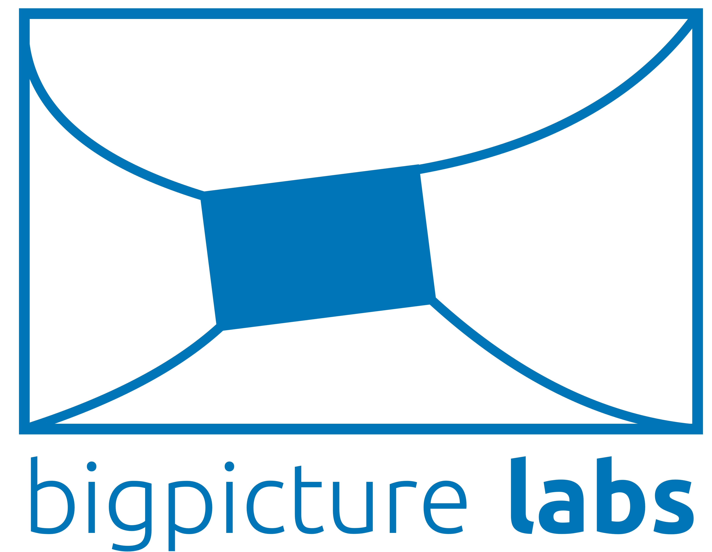

# it-chain     

## it-chain simulate video

click image to watch video

## An Ongoing Event
- 2018 Contributon: https://www.kosshackathon.kr/
  - it-chain: https://www.kosshackathon.kr/project

## Overview

Lightweight Customizable Chain For All

The it-chain is an easily modifiable block chain that can fit into any domain. To make it easier to customize, we have divided the it-chain into several independent components and minimized dependencies between them.

**It should not be used in production at this time.**

## Architecture of `it-chain`

The `it-chain` is implemented as six independently operating core components(txpool, Consensus, Blockchain, Peer, Authentication, iCode), each communicating via the Asynchronous Message Queue Protocol (AMQP). AMQP is an event bus connector that generates and distributes events for internal core components according to external messages coming into the gateway, and each core component receives and operates events that it has already registered.

A more detailed explanation is given below.
 - [ARCHITECTURE KR](./ARCHITECTURE-KR.md)
 - [ARCHITECTURE EN](./ARCHITECTURE-EN.md)

## Tutorial

How to install it-chain and run simple icode(smartContract) can be found in the tutorial docs. 
 - [INC_INTEGER_TUTORIAL](doc/TUTORIAL.md)
 - [BANK_TUTORIAL](doc/IVM-SAMPLE-BANK.md)

## Requirements

- Go-lang >= 1.9
- Docker >= 17.12.0
- Rabbitmq >= 3.7.7

## Contribution
Contribution Guide  
[CONTRIBUTION](CONTRIBUTING.md)

## Contact
Slack URL : https://it-chain-opensource.slack.com/

## License

It-Chain Project source code files are made available under the Apache License, Version 2.0 (Apache-2.0), located in the [LICENSE](LICENSE) file.

Open source license in use [LICENSES](LibraryList)

## Designed by
@Hyemin choi 
@Jieun Oh 
@Jongmo Moon 

## Sponsorship

<a href="http://bigpicturelabs.io">bigpicturelabs inc.</a> 

