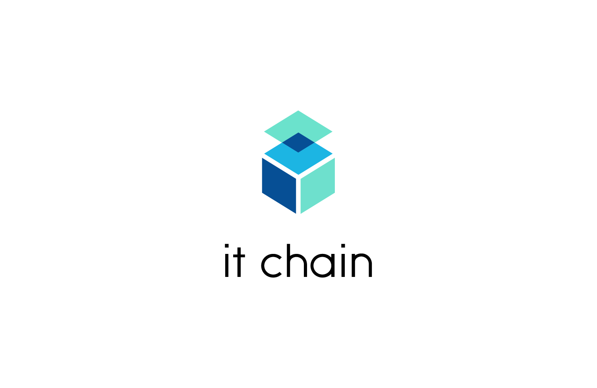

# it-chain

## Overview

Generalized Private Chain For All 

it-chain makes it easy for anyone to have their own block chain platform

Use Smart-Contract to create your own Dapp

## Contribution

Contribution documents will be updated shortly. 

For the time being, email leebduk@gmail.com

## Blockchain Key Concept
The key concept of blockchain can be found in the KEYCONEPT.  
[KEYCONCEPT](KEYCONCEPT.md)

## Implementation Details
Core implementation decisions can be found in the Project Implementation Details.  
[PROJECT IMPLEMENTATION DETAILS](PROJECT-IMPLEMENTATION-DETAILS.md)

## Contribution
Contribution Guide  
[CONTRIBUTION](CONTRIBUTION.md)

## License

It-Chain Project source code files are made available under the Apache License, Version 2.0 (Apache-2.0), located in the [LICENSE](LICENSE) file.

## Designed by
@Hyemin choi 
@Jieun Oh 
@Jongmo Moon 
