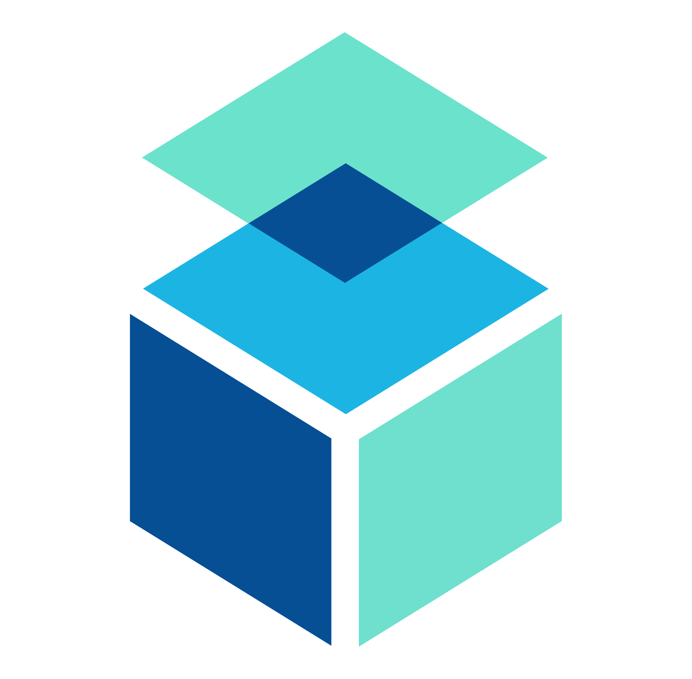
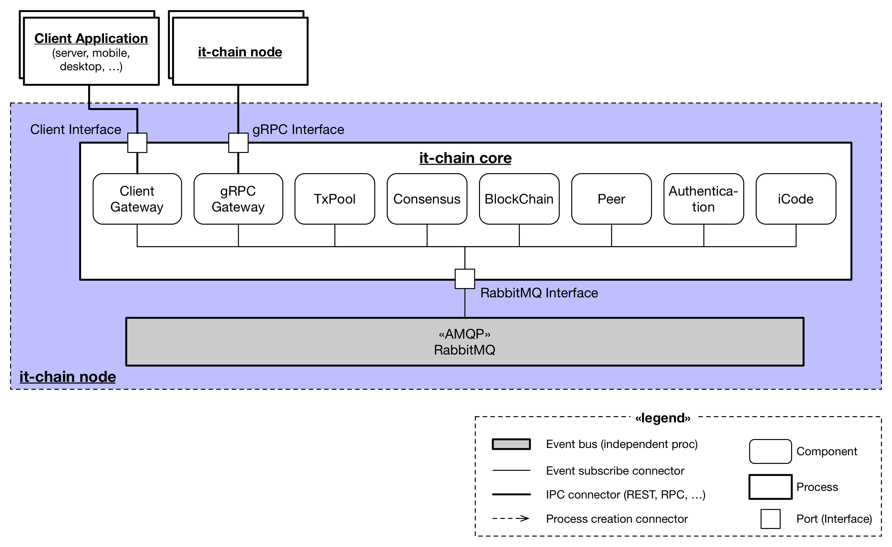

# it-chain

## Overview

Lightweight Customizable Chain For All

The it-chain is an easily modifiable block chain that can fit into any domain. To make it easier to customize, we have divided the it-chain into several independent components and minimized dependencies between them.

**The development is not completed yet. The beta version will be released in August.** 

## Logical Architecture of `it-chain`

The `it-chain` is implemented as six independently operating core components(txpool, Consensus, Blockchain, Peer, Authentication, iCode), each communicating via the Asynchronous Message Queue Protocol (AMQP). AMQP is an event bus connector that generates and distributes events for internal core components according to external messages coming into the gateway, and each core component receives and operates events that it has already registered.

A more detailed explanation is given below.
[LOGICAL ARCHITECTURE KR](doc/LOGICAL-ARCHITECTURE-KR.md)

## Requirements

- Go-lang >= 1.9
- Docker >= 17.12.0

## Implementation Details
Core implementation decisions can be found in the Project Implementation Details.  
[PROJECT IMPLEMENTATION DETAILS](doc/PROJECT-IMPLEMENTATION-DETAILS.md)

## Contribution
Contribution Guide  
[CONTRIBUTION](CONTRIBUTION.md)

## License

It-Chain Project source code files are made available under the Apache License, Version 2.0 (Apache-2.0), located in the [LICENSE](LICENSE) file.

## Designed by
@Hyemin choi 
@Jieun Oh 
@Jongmo Moon 
