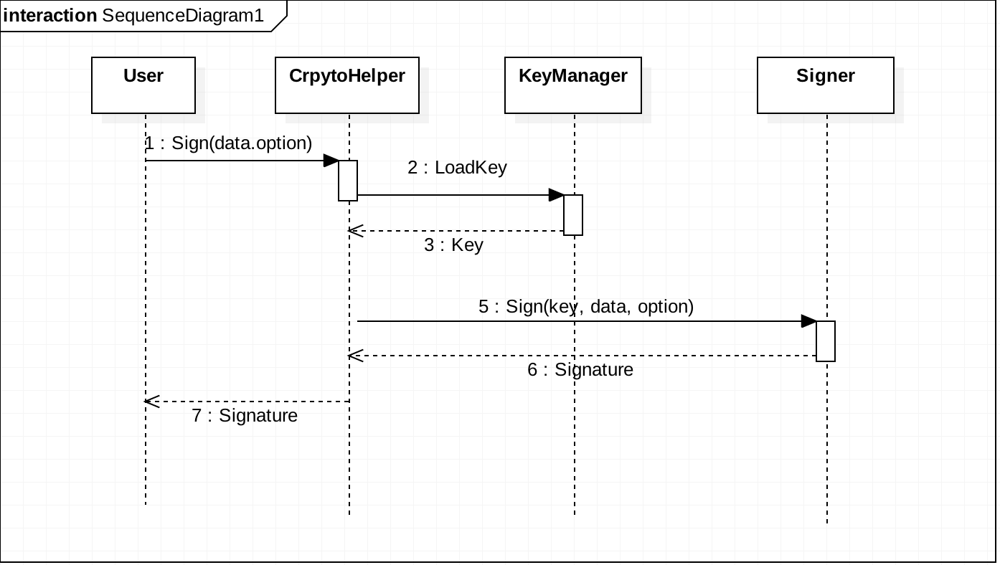

Crypto 
----------------------------

Crypto는 블록체인 플랫폼 내부의 데이터에 대한 서명/검증 관련 기능과 서명/검증에 사용되는 키를 관리하는 기능을 제공한다. *it-chain*은 `RSA`, `ECDSA`의 두 가지 서명 알고리즘을 지원한다.

-	KeyGenerator

	KeyGenerator는 서명 프로세스를 위해 선택된 서명 방식과 맞는 키를 생성한다.

-	KeyManager

	KeyManager는 생성된 키를 저장하고 불러온다.

-	Signer

	Signer는 데이터에 대한 서명을 수행한다.

-	Verifier

	Verifier는 서명된 데이터를 검증한다.

-	KeyUtils

	KeyUtils는 키를 `PEM` 파일로 변환시키는 등의 키 데이터를 저장하고 불러오는 과정에 필요한 작업들을 수행한다.

-	Key

	Key는 서명/검증에 필요한 키 데이터의 인터페이스와 관련된 속성 값들을 제공한다.

 

### 서명 순서도

 ​

### Author

[@yojkim](https://github.com/yojkim)[@owljoa](https://github.com/owljoa)
