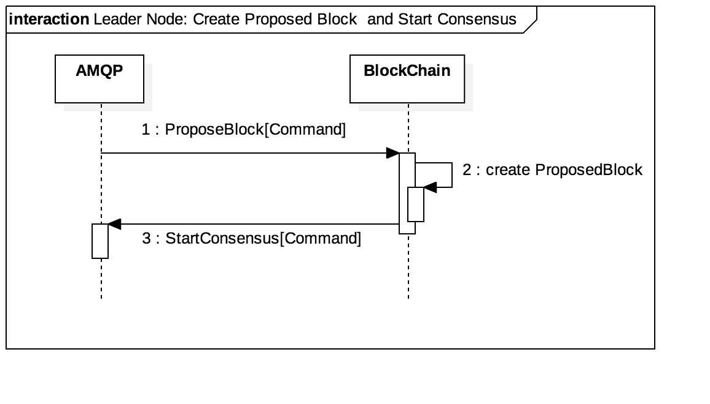
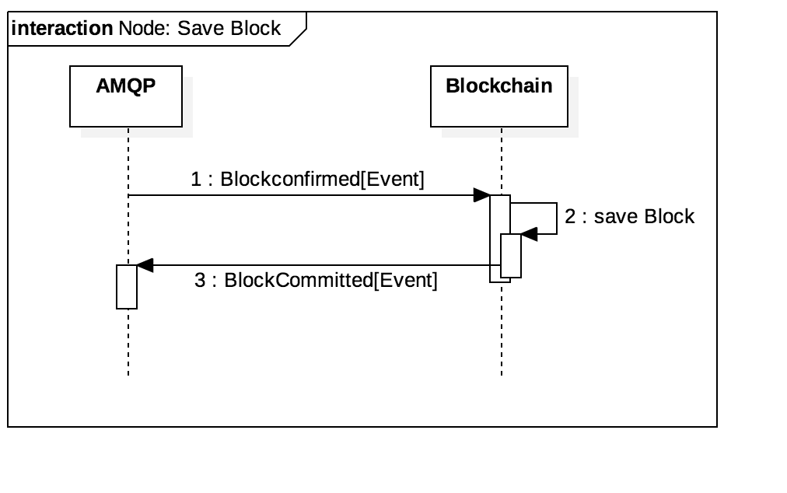

# Blockchain Component

## Intro

Blockchain Component는 **block 생성 • 저장 • 조회**, **blockchain 동기화**를 담당한다.


## Table of Contents

1. [Key Concepts](#Key Concepts)
2. [Block Create](#Block Create)
3. [Block Save](#Block Save)
4. [Block Retrieve](#Block Retrieve)
5. [Blockchain Synchronize](#Blockchain Synchronize)
6. [Communication](#Communication)
7. [Layers](#Layers)
8. [Scenario](#Scenario)
9. [Implementation Details](PROJECT-IMPLEMENTATION-DETAILS-KR.md)


## Key Concepts <a name = "Key Concepts"></a>

it-chain은 Blockchain Component를 customize 할 수 있도록 block 저장 및 조회를 [yggdrasill](https://github.com/it-chain/yggdrasill)에 위임한다. Blockchain Component는 yggdrasill에서 정의한 interface에 맞게 구조체를 구현한다면 yggdrasill에 block을 저장, 조회할 수 있다. yggdraill에 연속적으로 저장된 block들이 blockchain이다.


#### Default Objects

yggdrasill에는 block 저장을 위한 3개의 interface(`block`, `transaction`, `validator`)가 정의되어있다. 다음은 it-chain에서 yggdrasill의 interface에 맞게 구현한 구조체 예시이다. it-chain을 사용하는 모든 커뮤니티는 각자의 비즈니스 목적에 맞게 구조체를 Customize할 수 있다.

```
 type DefaultBlock struct {   
     Seal      []byte   
     PrevSeal  []byte   
     Height    uint64   
     TxList    []*DefaultTransaction
     TxSeal    [][]byte   
     Timestamp time.Time   
     Creator   []byte   
     State     BlockState
 }
```

```
type DefaultTransaction struct {
   ID        string
   ICodeID   string
   PeerID    string
   Timestamp time.Time
   Jsonrpc   string
   Function  string
   Args      []string
   Signature []byte
}
```

```
type DefaultValidator struct{} 
```


#### Block State

Blockchain Component는 맡은 역할을 원활히 수행하기 위해 Block의 상태를 다음과 같이 구분하였다.

| Block State | Description                                    |
| ----------- | :--------------------------------------------- |
| Created     | 합의되지 않았고, blockchain에 저장되지 않았다. |
| Staged      | 합의되었지만, blockchain에 저장되지 않았다.    |
| Committed   | 합의되었고, blockchain에 저장되었다.           |


## Block Create<a name = "Block Create"></a>

block의 생성은 `CreateGenesisBlock`과 `CreateProposedBlock`으로 나뉜다.

`CreateGenesisBlock`: 모든 노드는 특정 p2p 네트워크에 입장할 때 설정 파일(`Genesis.conf`)을 토대로 최초 block을 생성한다. 설정 파일을 변경하여 새로운 P2P 네트워크를 생성하거나 원하는 P2P 네트워크에 입장할 수 있다.

`CreateProposedBlock`: 리더 노드는 TxPool 컴포넌트에서 받은 transaction 모음과 blockchain에 저장된 마지막 block의 정보를 토대로 block을 생성한다.



## Block Save<a name = "Block Save"></a>

block을 yggdrasill에 저장한다. block 저장은 다음의 검증 과정 이후 수행된다.

1. `PrevSeal` 검증: blockchain에 저장된 마지막 block의 `Seal`과 저장할 block의 `PrevSeal`이 같은 지 비교
2. `Seal` 검증 : 저장할 block의 `Timestamp`, `PrevSeal`, `TxSeal`, `Creator`를 이용해 새로 만든 `Seal`과 저장할 block의 `Seal`이 같은 지 비교
3. `TxSeal` 검증: 저장할 block의 TxList를 이용해 새로 만든 `TxSeal`과 저장할 block의 `TxSeal`이 같은 지 비교



## Block Retrieve<a name = "Block Retrieve"></a>

block의 값(`Height`, `Seal` 등)을 기준으로 yggdrasill에 저장된 block을 조회한다.


## Blockchain Synchronize<a name = "Blockchain Synchronize"></a>

1. 동기화(Synchronize)는 특정 노드의 블록 체인을 네트워크 내 임의의 노드의 블록 체인과 동일하게 만드는 과정을 의미한다. 즉 동기화(Synchronize) 과정을 통해 특정 노드는 모든 블록에 대하여 대표값(Seal), 이전 블록의 대표값(PrevSeal), 트랜잭션 모음(TxList), 트랜잭션 대표값(TxSeal), 블록 생성 시각(TimeStamp), 생성자(Creator), 블록 체인의 길이(Height) 등의 블록 체인과 관련된 모든 정보들을 다른 노드의 것과 동일화한다.
2. 동기화(Synchronize)는 **확인(Check)**, **구축(Construct), 재구축(PostConstruct)** 의 과정을 거친다.
3. **확인(Check)** 은 특정 노드의 블록 체인이 동기화가 필요한 상태인지를 점검한다. **확인(Check)** 의 과정은 임의의 노드에게 Blockchain 길이와 lastSeal을 받아와서 자신의 블록 체인 정보가 같은 지 비교하여, 동기화가 필요한 상태인지 점검한다(SyncedCheck). 이미 동기화가 완료된 상태라면, 동기화(Synchronize) 과정을 중단한다. 그렇지 않을 경우, **구축(Construct)** 을 수행한다.
4. **구축(Construct)** 은 임의의 노드에게 블록 정보를 요청하여, 응답받고, 응답받은 블록을 블록 체인에 저장하는 과정을 순차적으로 반복함으로써 수행된다.
5. 블록 요청은 특정 노드의 블록 체인 길이(Height)를 활용해, 임의의 노드에 블록을 요청함으로써 수행된다. 특정 노드가 새로 참여하는 노드일 경우 임의의 노드의 블록 체인 내 최초 블록부터 마지막 블록까지 요청하고, 기존에 참여중이던 노드일 경우 보유 중인 블록 체인 내 마지막 블록의 다음 블록부터 임의의 노드의 블록 체인 내 마지막 블록까지 요청한다.
6. 임의의 노드의 모든 블록이 특정 노드의 블록체인에 저장되면 **구축(Constrcut)**이 완료된다.
7. 특정 노드는 **구축(Construct)** 의 진행 중에 새롭게 합의되는 블록을 블록 임시 저장소(BlockPool)에 보관한다. **구축(Construct)** 이 완료되고 나면, 블록 임시 저장소에 블록이 보관되어 있는 지 확인한다(PoolCheck). 보관중인 블록이 있다면, **재구축(PostConstruct)**을 수행한다.
8. **재구축(PostConstruct)** 은 이미 **구축(Construct)** 된 블록 체인에 블록 임시 저장소(BlockFool)에 보관중인 블록들을 부수적으로 추가하는 것을 의미한다. **재구축(PostConstrcut)** 을 수행하고 나면, 동기화(Synchronize) 과정이 모두 완료된다.


## Communication<a name = "Communication"></a>

#### Publish

- **StartConsensus[Command]**
  - Consensus Component에 특정 block에 대한 합의를 시작하라고 요청하는 Command이다. 합의할 block의 모든 정보를 가지고 있다.

- **BlockCommitted[Event]**
  - 블록체인에 블록을 저장할 때 발행하는 Event이다. 저장된 블록의 모든 정보를 가지고 있다.

#### Consume

- **ProposeBlock[Command]**
  - TxPool Component에서 일정 개수의 transaction이 모였을 때 Blockchain Component에 block 생성을 요청하는 Command이다. block 생성을 위한 transaction 모음의 모든 정보를 가지고 있다.

- **BlockConfirmed[Event]**
  - Consensus Component에서 block의 합의 완료 후 발행하는 Event이다. 합의된 block의 모든 정보를 가지고 있다.


## Layers<a name = "Layers"></a>

#### Infra

- **HandleProposedBlockCommand**
  - TxPool Component에서 block 생성을 위해 보낸 Command를 처리한다.
- **HandleBlockConfirmedEvent**
  - Consensus Component에서 block의 합의를 마쳤을 때 발행하는 Event를 처리한다.
- **ConsensusService**
  - Consensus Component에 특정 block에 대한 합의를 요청하는 Command를 발행한다.

#### API

- **CommitGenesisBlock**
  - 최초 block을 생성하고 blockchain에 저장한 후 관련 정보를 다른 Component에 알린다.
- **CommitProposedBlock**
  - TxPool Component로부터 받은 transaction 모음을 토대로 block을 생성하고 blockchain에 저장한 후 관련 정보를 다른 Component에 알린다.

* **Synchronize**
  * blockchain을 동기화한다. 동기화는 자신의 blockchain을 P2P 네트워크에 있는 임의의 노드의 blockchain과 동일하게 만들어주는 것을 의미한다.

## Scenario<a name = "Scenario">

본 시나리오는 Blockchain Component와 관련된 흐름을 다른 Component와 연동하여 간략하게 보여준다.


1. 노드 A는 Genesis.conf 파일을 알맞게 수정 후 GenesisBlock을 생성하여 P2P 네트워크를 시작한다. 이 시나리오에서는 노드 A를 리더노드라고 가정한다.
2. 노드 B는 Genesis.conf 파일을 노드 A의 것과 동일하게 수정 후 GenesisBlock을 생성하여 노드 A가 만든 P2P 네트워크에 참여한다.
3. Client는 네트워크의 프록시 서버에 transaction을 요청하고, 프록시 서버는 transaction을 네트워크 내 노드들에 분배한다.
4. 노드 B의 TxPool Component에 transaction이 쌓이면 리더인 노드 A에 transaction을 전송한다.
5. 노드 A의 TxPool에 transaction이 쌓이면 transation모음과 blockchain 내 마지막 block 정보를 토대로 새로운 block을 생성한다.
6. 노드 A는 생성한 block을 Consensus Component에 넘겨 노드 B와 합의한다.
7. block이 합의를 마치고 나면 노드 A, 노드 B 모두 해당 block을 blockchain에 저장한다. 저장한 block은 event에 담아 발행하여 다른 Component에 blockchain에 block이 저장되었다는 사실을 알린다.
8. 노드 C는 GenesisBlock을 생성하여 노드 A와 노드 B가 있는 P2P 네트워크에 참여한다.
9. 노드 C는 네트워크 내 임의의 노드와 blockchain을 동기화한다.
10. 만약 9의 과정 중 3~6의 과정이 진행될 경우, 노드 C는 합의된 block의 상태를 staged로 변경하고 BlockPool에 임시 저장한다. 9의 과정이 완료되면 임시 저장한 block의 상태를 committed로 변경하고 blockchain에 저장 및 event 발행한다.


## Implementation Details

[IMPLEMENTATION-DETAILS-KR.md](PROJECT-IMPLEMENTATION-DETAILS-KR.md)

### Author

[@junk-sound](https://github.com/junk-sound), [@zeroFruit](https://github.com/zeroFruit)
