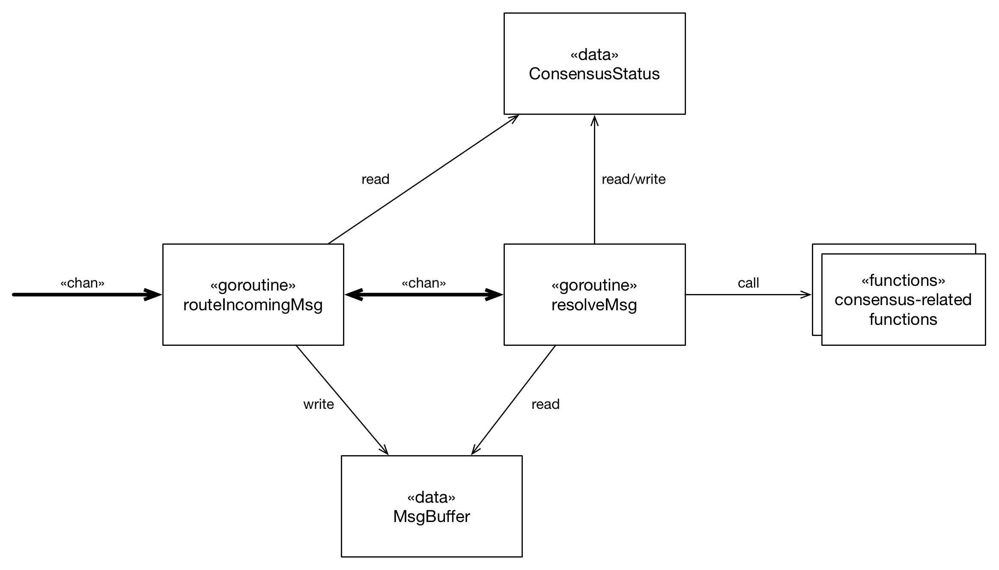

## 합의(Consensus) 

### PBFT consensus

[KEYCONCEPT](../doc/KEYCONCEP.md)의 PBFT 항목을 참조.

### Proposed architecture for the PBFT consensus

합의 절차는 요청 메세지(request message)가 도착하거나, Pre-prepare 메세지가 도착했을 때 시작된다. 만약 노드가 리더 노드(leader node or primary node)일 경우, 요청 메세지가 도착했을 때 합의 절차를 시작하고, 일반 노드일 경우 `pre-prepare` 메세지가 도착했을 때 합의 절차를 시작한다. 합의 절차가 시작되면 노드의 합의 상태(Consensus status)는 `Ready`가 되고 노드는 합의와 관련된 요소들(예: 관련 struct 들, 고루틴들, 채널들 등)을 생성 및 실행한다. 시작 행위가 완료될 경우, 노드는 미리 도착한 메세지가 없는지 메세지 버퍼를 살펴본 후 `Preparing` 상태로 나아간다. `Preparing` 상태에서는 노드는 `isPrepared`가 참이 될 때까지 `prepare` 메세지를 처리한다. 그 후, 이전 상태 때와 마찬가지로, 노드는 그 사이 도착한 메세지가 없는지 메세지 버퍼를 확인하고, `Committing` 상태로 나아간다. `Committing` 상태는 `Preparing` 상태와 동일하게 진행한다. 그리고 만약 `isCommitted`가 참이 된다면, 노드는 `Committed` 상태로 변경되고, 요청 메세지에서 실행해주길 요청한 기능(Operation)을 수행한다. 그리고 그 수행 결과를 처음 요청을 보낸 클라이언트에게 개별적으로 전송한다.

PBFT 합의를 수행하기 위해, 위의 다이어그램과 같은 코드 구조를 제안한다. `routeIncomingMsg` 고루틴은 데몬 고루틴으로 들어오는 합의 관련 메세지를 받아서 그들을 `MsgBuffer`의 적절한 위치에 배치한다.`resolveMsg` 고루틴은 버퍼로부터 메세지를 읽어들여 관련된 합의 함수를 호출한다. 만약 필요하다면, 이 고루틴은 합의 상태(`ConsensusStatus`) 값을 변경한다.

전반적인 행위 모습은 위 다이어그램과 같다. `routeIncomingMsg` 고루틴이 들어오는 메세지를 받을 경우, 우선 합의 상태를 체크한다. 만약 들어온 메세지가 현재 합의 상태에 맞는 메세지라면(예: `ConsensusStatus`가 `Preparing`일 때, 들어온 메세지가 `prepare` 메세지인 경우), 이 고루틴은 `resolveMsg` 고루틴에게 버퍼 메세지를 처리하라는 시그널을 보낸다. 만약 메세지와 현재 합의 상태가 맞지 않는다면, `MsgBuffer`에 해당 메세지를 일단 저장해둔다.

`resolveMsg` 고루틴은 버퍼 메세지를 읽어들여 이를 처리하기 위한 관련 합의 함수들을 호출한다. 만약 필요하다면, 현재의 합의 상태를 변경한다. 만약 합의 상태를 변경했다면, 이 고루틴은 `MsgBuffer`를 다시 한번 체크하여 새 합의 상태에 맞는 저장된 메세지를 다시 읽어들여 처리한다.

이 제안된 아키텍처는 실제 구현과 맞지 않을 수 있다.

### Author

[@Junbeomlee](https://github.com/junbeomlee)

[@Hwi Ahn](https://github.com/byron1st)
