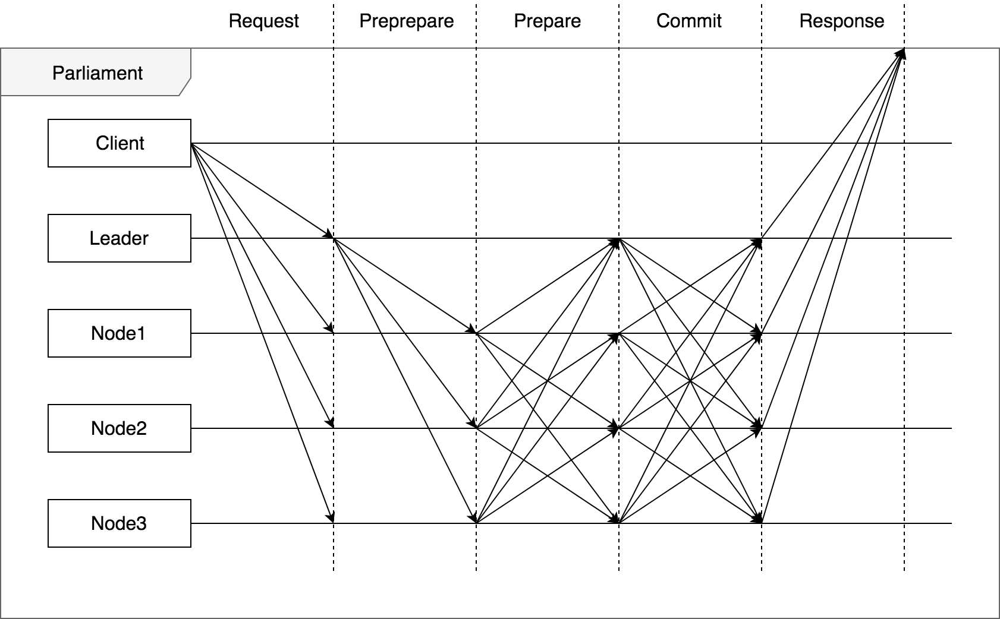

# PBFT(Practical Byzantine Fault Tolerance) Consensus

In PBFT, consensus is performed between the members of the peer-to-peer network of the engine and initiated by the leader node.
The consensus / PBFT module of the it-chain performs only **consensus on the storage order of the** blocks initiated by the reader.

If the contents of a block are verified transactions and the result of each transaction is deterministic, then all the nodes will always have the same world state when the storage order of the blocks is agreed upon exactly.

## PBFT consensus algorithm

In it-chain core engine, the consensus is made by PBFT algorithm.



The following is a brief explanation of the procedure of PBFT consensus algorithm

1. the client requests to every node in the network
2. if the leader of the network receives the request of a client, it broadcasts propose messages to the p2p network
3. every node in the network which received the message broadcasts prevote message to the network
4. a node which received more than 2/3 of prevote messages broadcasts precommit message to the network
5. consensus complete

**In It-chain, only the leader can propose and create the block. So, there is no client, no request, and no response.**

## Basic Concept of implementation

1. Leader's consensus component receives the request from the blockchain component.
2. Leader creates the consensus that has information about representatives and proposed block.
3. Broadcasts propose messages to every representatives.
4. Each representative who received the propose message constructs the consensus by given info. Then, broadcasts prevote messages to the network.
5. Each representative who received more than "1/3 of representatives + 1" prevote messages broadcasts precommit messages to the network.
6. Each representative who received more than "1/3 of representatives + 1" precommit messages publishes the block confirm event and removes the consensus.

### Consensus State

- IDLE_STATE : A consensus is generated, but does not anything.
- PROPOSE_STATE : The consensus (only leader) sent the propose messages.
- PREVOTE_STATE : The consensus sent the prevote messages.
- PRECOMMIT_STATE : The consensus sent the commit messages.

### Parliament

`Parliament` is the group of nodes which participate in consensus procedure. Every node in parliament is called `Representative` in the sense of being a voter in consensus. `Representatives` are selected by `func Elect(parliament []MemberId) ([]*Representative, error)`.

## Procedure detail

1. The blockchain component of the leader requests a consensus to the consensus component.
2. The leader's consensus component creates a consensus about the requested block.
3. The leader make the propose messages which has information of leader's consensus. Then, broadcasts them to every representative.
4. Each representative who receives the leader's propose message creates a consensus. And sends the prevote messages to all other representatives.
5. If the number of received prevote messages is equal to or greater than "1/3 of representatives + 1", validates the block in that message. Then, the representative sends the precommit messages to all other representatives.
6. If the number of received precommit messages is equal to or greater than "1/3 of representatives + 1", confirms the block.
7. Removes the finished consensus.

## The kinds of PBFT consensus messages

The consensus between representatives is made by sending and receiving certain kind of consensus messages.

The following is the kind of message used between representatives.

### Propose message

A message sent by the leader of network to inform other representatives in parliament.

### Prevote message

The message sent to all other representatives from each representative.

Each representative in the network of n representatives receives the number of n-1 prevote messages, so that every representative in the network can determine which is the proper message which is chosen by most of the representatives

### PreCommit message

Every representative in the network determine the most reliable message which is chosen by most of the representatives and broadcast PreCommit message to all other representatives in the network.

### Message pool

**prevote message pool**
Before broadcast precommit message, every representative should determine the message that includes the most reliable block that most of the representatives agree with.
So that the `prevote message` should be saved in `prevote message pool` until the representative receives every other representative prevote message

**precommit message pool**
Until the block is confirmed, the `precommit message` should be saved in `precommit message pool`

## Event & Command

### Event
- Publish
```go
// When the consensus is finished, this event will be published.
type ConsensusFinished struct {
	Seal []byte
	Body []byte
}
```

### Command
- Publish
```go
// This command is used to send propose, prevote, precommit messages to the network.
// The serialized messages will be included in Body.
// Distinguishing which message is received is done by Protocol.
type DeliverGrpc struct {
	MessageId     string
	RecipientList []string
	Body          []byte
	Protocol      stringS
}
```

- Handle
```go
// This command is handled when propose, prevote, precommit messages are received.
// The messages are included in Body and distinguished by Protocol.
type ReceiveGrpc struct {
	MessageId    string
	Body         []byte
	ConnectionID string
	Protocol     string
}
```
```go
// This command is delivered from the Blcokchain component.
// When this command is handled, the consensus is created.
// Only leader uses this command.
type StartConsensus struct {
	Seal   []byte
	TxList []Tx
}
```

## API
```go
// The leader creates a consensus and sends a propose messages to representatives.
func StartConsensus(block pbft.ProposedBlock) error
```
```go
// When the propose message is delivered, the receivers construct a consensus and send a prevote message to other representatives.
func HandleProposeMsg(msg pbft.ProposeMsg) error
```
```go
// When the prevote messages are delivered, the receivers save those messages in the prevote message pool, validate them, and send a precommit message to other representatives.
func HandlePrevoteMsg(msg pbft.PrevoteMsg) error
```
```go
// When the precommit messages are delivered, the receivers save those messages in the precommit message pool, validate them, and publish the ConsensusFinished event.
func HandlePreCommitMsg(msg pbft.PreCommitMsg) error
```


## Future Work

- World State Value validation


## Author

[@hihiboss](https://github.com/hihiboss)
[@frontalnh](https://github.com/frontalnh)
[@ChaeByunghoon](https://github.com/ChaeByunghoon)
