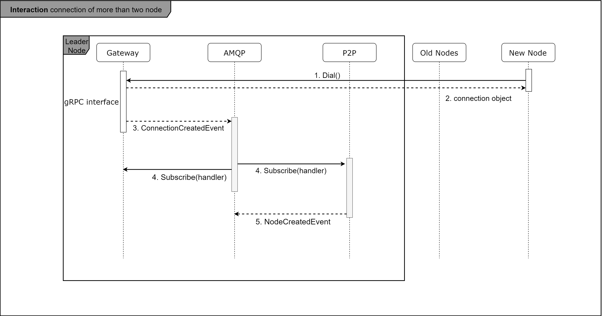

# IT-CHAIN-SCENARIO

## 최초 노드 boot 시의 시나리오
최초의 노드에서 처음으로 P2P 네으워크를 비롯한 블록체인 엔진을 작동시킴에 따른 시나리오로 다음과 같은 순서로 이루어 진다.

1. P2P 네트워크 구축을 위한 준비
2. 노드 내 컴포넌트간 통신을 위한 AMQP 서버 구동
3. 피어등록
4. 리더 선정

it-chain-Engine 은 여러 노드들이 이어진 P2P 네트워크가 구축되어야 하며, 구체적인 구현은 gateway 컴포넌트에서 이루어 진다.
gateway의 `start()` 함수 호출을 통해 모든 작업이 시작되며, 지정한 포트에서 gRPC 서버 listen을 수행함은 물론 다른 컴포넌트들과 메세지를 주고받기 위한 rabbitMQ 기반의 AMQP server의 구동까지 완료된다.

과정에서 gRPC 인터페이스를 구축함에 있어 grpc lib을 사용하는 것이 일반적이지만, it-chain 에서는 이를 보다 쉽게 구현하기 위해 별도로 p2p 네트워크 라이브러리인 `bifrost` 라이브러리를 자체 제작하여 사용하고있다. `bifrost` 를 통해 gRPC 인터페이스를 보다 쉽게 구축 할 수 있을 뿐만 아니라 해당 p2p 네트워크의 전체 연결정보를 쉽게 관리하고 정보를 열람할 수 있다.

<!-- 어느 단계에서 gateway.Start() 가 수행이 될 지 정해지지 않았다. 아마 it-chain-Engine이 구동되는 시점에서 실행되는 것이 맞지 않나 싶다. -->

gRPC 및 AMQP 서버가 구동이 완료되었다면, P2P 네트워크를 형성하는 노드 리스트에 해당 노드 객체를 생성하여 추가해 주는데, 이에 대한 구현은 P2P 컴포넌트에서 이루어 진다. P2P 컴포넌트의 초기화 시점에서 nodeID와 노드 객체를 생성해 repo에 추가해 주고, 해당 노드가 등록된 사실을 AMQP 에 전달하고 AMQP 의 이벤트를 gateway에서 받아 해당 노드가 등록된 사실을 알고 다른 노드들에게 새로운 노드가 등록되었음을 P2P 네트워크에 알리게 된다.

<!-- 노드 ID의 생성기준에 대한 명시가 필요함-->

최초의 노드의 경우 아직 P2P 네트워크가 구성되지 않았으므로 **리더는 존재하지 않는다.**
다만 이후의 노드가 해당 노드에 dial을 거는 경우 아직 leader repo 에 leader가 없는 경우 dial을 받은 노드가 leader repo를 찾아 leader가 선출되어 있는지를 판단하고 leader가 없다면 자기 자신이 leader가 되어 repo에 저장되게 되며, 이러한 사실은 네트워크 전체에 전파된다.

## 이후의 노드가 네트워크에 연결되는 시나리오

**1. P2P 네트워크 접속**
특정 ip로 dial 하여 P2P 네트워크에 접속하며 다음과 같은 과정을 거칩니다.

먼저 cli 에서 특정 ip로 dial 하여 p2p 네트워크에 접속합니다.

dial 하는 시점에서 dial을 수신하는 노드는 leader repository를 확인하여 존재한다면 leader 정보를 전달하고 존재하지 않는다면 자기 자신을 leader로 선출하고 이 사실을 다른 노드들에 알립니다.

네트워크 내의 다른 peer 정보를 해당 노드의 클라이언트에 저장합니다.

**2. 추가 노드 객체 생성 및 저장**
1. 내 ip를 기준으로 노드 정보 생성 및 저장
2. 생성한 노드 정보를 기존의 노드들에게 전달하고 전체 P2P 네트워크의 구성 노드정보에 추가된 노드를 추가

**3. 리더 선정**
리더를 선출하고 리더가 누구인지에 대한 정보를 모든 노드들 사이에서 공유

## 최초의 트랜잭션 발생 시나리오
1. 사용자가 tx 생성 요청
2. txpool 에 저장
3. txpool에서 consume
4. pool에 등록
5. api 호출
createtx
6. amqp 등록
7. create event 객체생성
8. pool에서 tx 생성
9. leveldb 저장

## 블록 생성
## 합의과정
## 블록 저장
## 블록 전파
