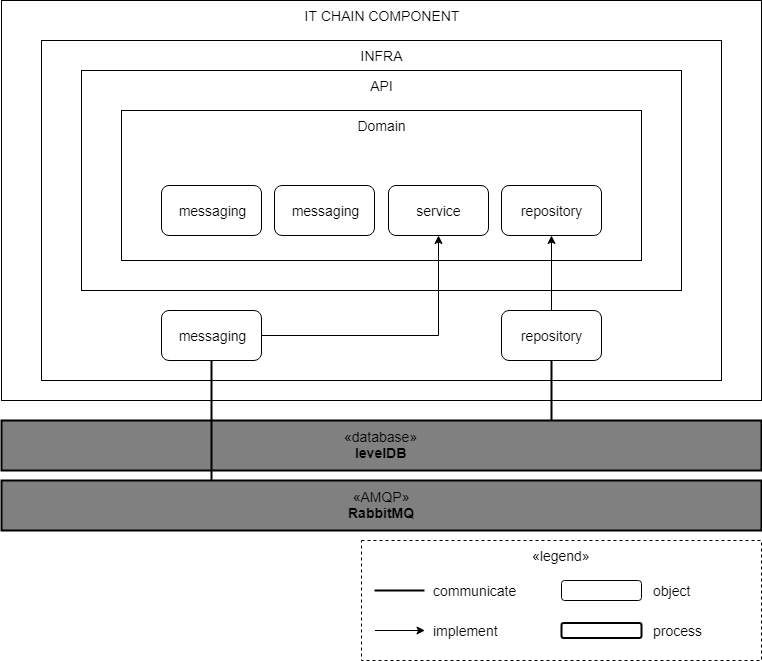

# Logical Architecture of `it-chain`

`it-chain`의 개념 수준 아키텍처 모델은 위 그림과 같다. `it-chain` 노드는 2개의 게이트웨이 컴포넌트(`Client API Gateway` 와 `Inter-Node API Gateway`)를 통해 외부 네트워크 노드(다른 `it-chain` 노드 또는 클라이언트 어플리케이션들)와 연결된다.

* `Client Gateway`: 클라이언트 어플리케이션(서버, 모바일 앱, 데스크톱 앱 등)들을 위한 API로 REST로 제공될 예정이다.
* `gRPC Gateway`: `it-chain` 노드 간의 커뮤니케이션을 위한 서비스로, 블록 싱크, 합의 메세지 등과 같이 블록체인과 관련된 커뮤니케이션을 처리한다. RPC 형태로 제공될 예정이다.

또한 `it-chain`은 6개의 독립적으로 동작하는 핵심 컴포넌트들로 구현되며, 각각은 AMQP(Asynchronous Message Queue Protocol)를 통해 커뮤니케이션한다. AMQP는 이벤트 버스 커넥터이며, 게이트웨이로 들어온 외부 메세지에 맞춰 내부 핵심 컴포넌트들을 위한 이벤트를 생성하여 배포하며, 각 핵심 컴포넌트들은 자신들이 이미 등록한 이벤트를 받아서 동작한다. AMQP의 구체적인 구현체는 [RabbitMQ](https://www.rabbitmq.com)를 사용한다.

`it-chain core`의 각 컴포넌트는 동작에 필요한 데이터를 직접 갖고 있다 (Micro Service Architecture 구조에서 참조). 그렇기 때문에 경우에 따라선 데이터가 서로 다른 컴포넌트에 중복되서 저장될 수 있으며, 이를 허용한다.

* TxPool 컴포넌트: 트랜잭션을 임시로 저장하고 관리하는 컴포넌트로, 합의되어 블록에 저장되지 않은 트랜잭션들을 모아둔다.
* Consensus 컴포넌트: 합의를 담당하는 컴포넌트이며, 현재는 PBFT(Practical Byzantine Fault Tolerance) 알고리즘을 따른다.
* BlockChain 컴포넌트: 블록을 생성하고 관리하는 컴포넌트이다.
* P2P 컴포넌트: 네트워크의 참여하는 Peer들을 찾고, 유지하는 컴포넌트이다.
* Auth 컴포넌트: 각종 인증을 담당한다.
* iCode 컴포넌트: it-chain의 스마트 컨트랙트인 iCode 관련 기능을 담당한다.

# Strategic Model Design
각 Service 내의 Strategic Model Design은 다음과 같다.

위 그림과 같이 Strategic Design은 Onion Architecture 형태를 띄며, 여기서 핵심의 외곽에 있는 layer만이 안에 있는 layer를 import 할 수 있고 내부 layer는 바깥쪽 layer를 import 할 수 없다는 점이다.

하지만 Domain 과 API 의 많은 기능들은 infra가 제공하는 기능을 사용해햐 하는데 이것이 어떻게 가능할까라는 문제점이 제기된다.
이것은 바로 domain 내에서 infra 내의 기능들에 대한 interface를 구현에 둠으로써 해결되고, 이를 통해 infra를 완벽하게 숨기고 로직을 처리할 수 있게 된다.

## API
API 레이어는 다른 bounded context와 협력을 위한 다양한 api를 제공한다.
다른 bonded context 내의 서비스들을 오직 api를 통해서만 해당 서비스에 접근이 가능하다.

## Domain
도메인 레이어는 크게 model, factory, service, repository 로 구성된다.

### model
model 은 해당 bounded context 에서 주로 사용되는 entity와 이를 구성하는 value object를 정의한다.

### factory
factory는 model의 entity를 생성해 주는 역할을 담당하며, 다양한 값을 받아 value object를 구현하고 이를 조합하여 entity를 생성해 반환해 주는 역할을 수행한다.

### Service
service는 해당 subcontext 내의 다양한 기능을 수행하며, infra의 기능들에 대한 interface를 만들어 준다.
api 와 service 내에서 infra layer에 접근하지 않기 위해서 이 service 단에서 interface를 구현해 두고 필요한 경우 사용한다.

### repository
repository는 entity 및 value object 를 기준으로 하여 db와의 입출력을 담당하며, it-chain에서는 levelDB와의 통신을 수행한다.
하지만 직접적인 통신의 구현은 infra layer 에서 수행하며, 본 repository에서는 실제적인 구현 내용은 숨기고 interface 형태로 함수만을 선언하여 기능을 추상화 시켜준다.

## Infra
infra layer 에서는 messaging 및 levelDB 통신 등 서비스에 필요한 기반환경을 구현하고 있다.
앞서 repository 에서 정의한 함수에 대한 실질적인 구현이 이루어지며, rabitMQ 서버와 통신을 구현한다.

---
