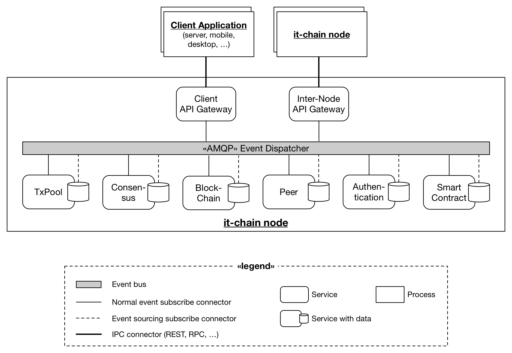
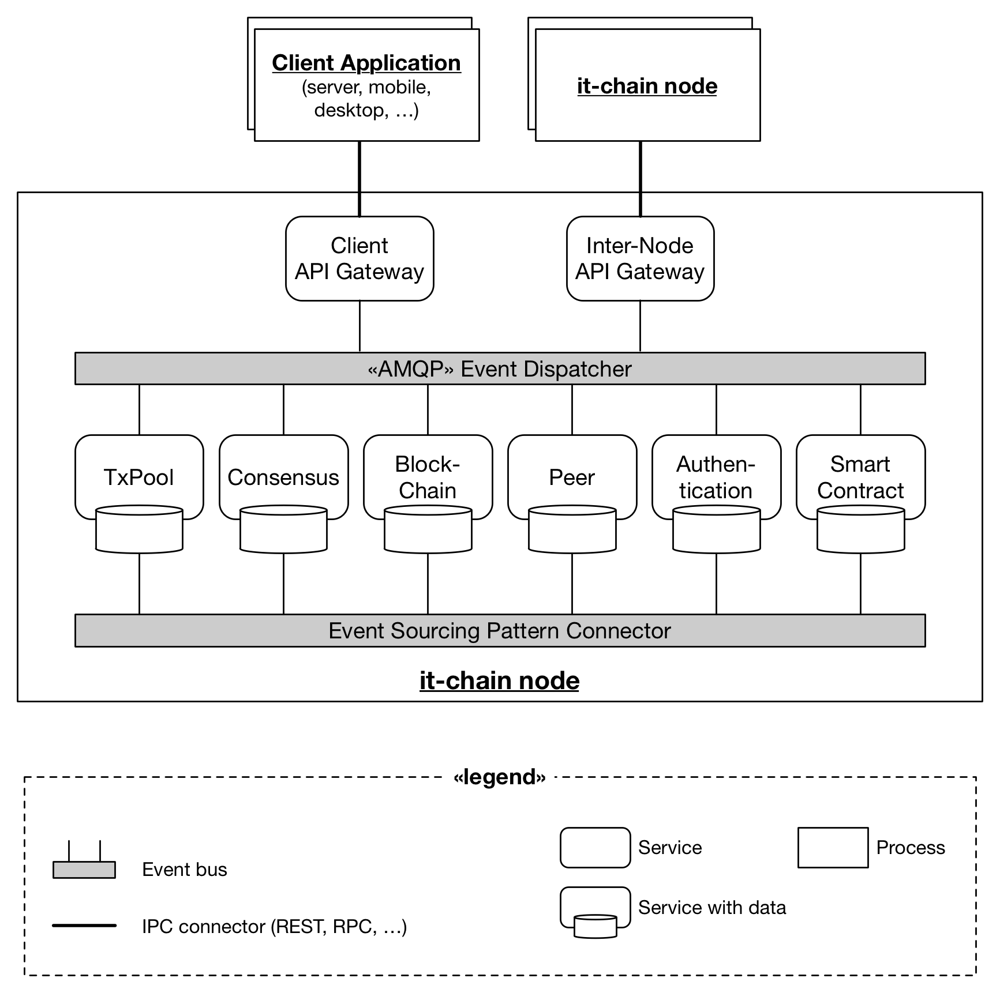

# Logical Architecture of `it-chain`

`it-chain`의 개념 수준 아키텍처 모델은 위 그림과 같다. `it-chain` 노드는 2개의 게이트웨이 서비스(`Client API Gateway` 와 `Inter-Node API Gateway`)를 통해 외부 네트워크 노드(다른 `it-chain` 노드 또는 클라이언트 어플리케이션들)와 연결된다.

* `Client API Gateway`: 클라이언트 어플리케이션(서버, 모바일 앱, 데스크톱 앱 등)들을 위한 API로 REST로 제공될 예정이다.
* `Inter-Node API Gateway`: `it-chain` 노드 간의 커뮤니케이션을 위한 서비스로, 블록 싱크, 합의 메세지 등과 같이 블록체인과 관련된 커뮤니케이션을 처리한다. RPC 형태로 제공될 예정이다.

또한 `it-chain`은 6개의 독립적으로 동작하는 핵심 서비스들로 구현되며, 각각은 AMQP(Asynchronous Message Queue Protocol)를 통해 커뮤니케이션한다. AMQP는 이벤트 버스 커넥터이며, 게이트웨이로 들어온 외부 메세지에 맞춰 내부 핵심 서비스들을 위한 이벤트를 생성하여 배포하며, 각 핵심 서비스들은 자신들이 이미 등록한 이벤트를 받아서 동작한다.

각 서비스는 동작에 필요한 데이터를 직접 갖고 있다 (Micro Service Architecture 구조에서 참조). 그렇기 때문에 경우에 따라선 데이터가 서로 다른 서비스에 중복되서 저장될 수 있으며, 이를 허용한다. 대신 동일한 데이터에 대한 싱크는 이벤트 소싱 패턴 이용하여 구현되며 커뮤니케이션 통로는 동일한 Event Dispatcher를 이용한다. (대안 아키텍처: 이벤트 소싱만을 위한 독립적인 커넥터 인스턴스를 구현할 경우 맨 아래 그림과 같이 될 수 있다.)

* TxPool 서비스: 트랜잭션을 임시로 저장하고 관리하는 서비스로, 합의되어 블록에 저장되지 않은 트랜잭션들을 모아둔다.
* Consensus 서비스: 합의를 담당하는 서비스이며, 현재는 PBFT(Practical Byzantine Fault Tolerance) 알고리즘을 따른다.
* BlockChain 서비스: 블록을 생성하고 관리하는 서비스이다.
* Peer 서비스: 하위 레벨의 P2P 네트워크를 담당하는 서비스이다. 
* Authentication 서비스: 각종 인증을 담당한다.
* SmartContract 서비스: 스마트 컨트랙트 관련 기능을 담당한다.

## 대안 아키텍처: 이벤트 소싱 커넥터 분리

이벤트 버스 인스턴스를 2개 유지하고, 하나를 이벤트 소싱 전용 커넥터로 이용하는 방법.