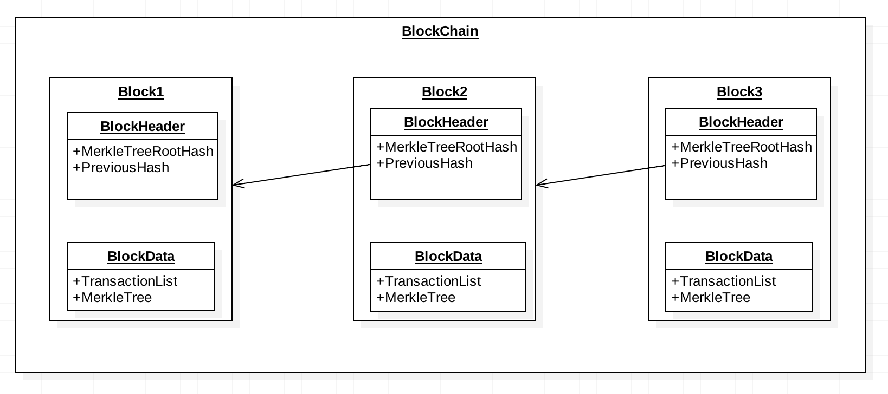
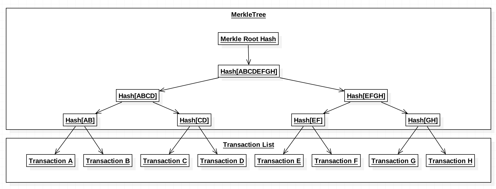
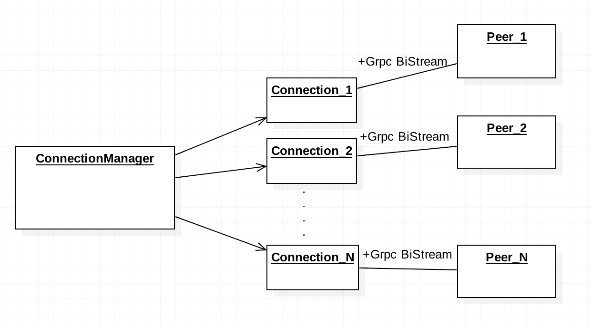
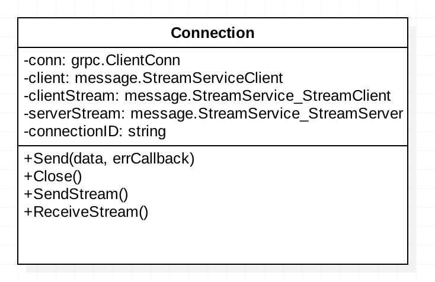
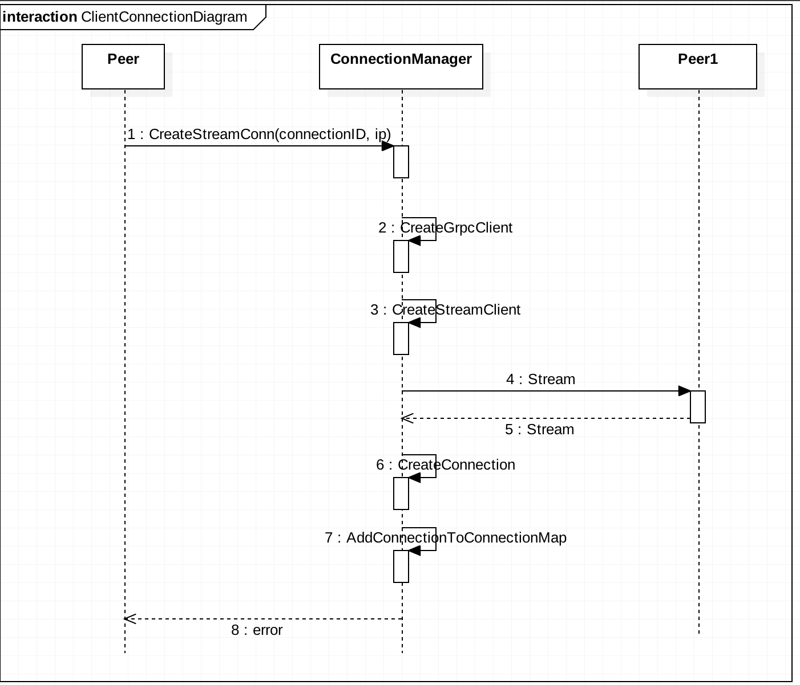
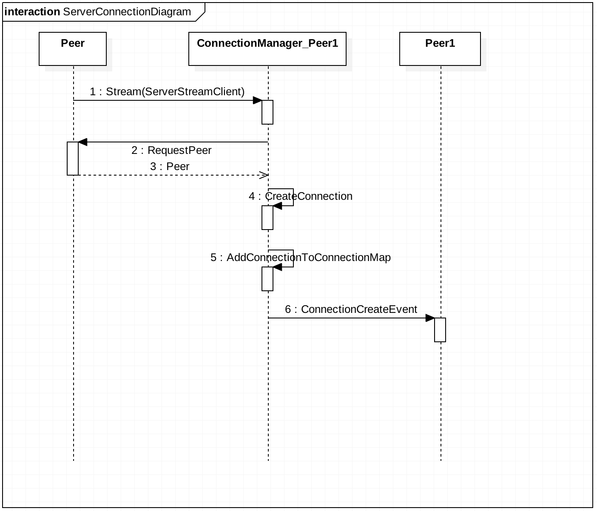
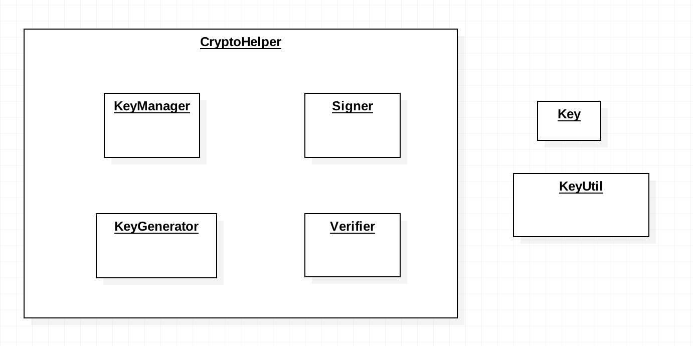
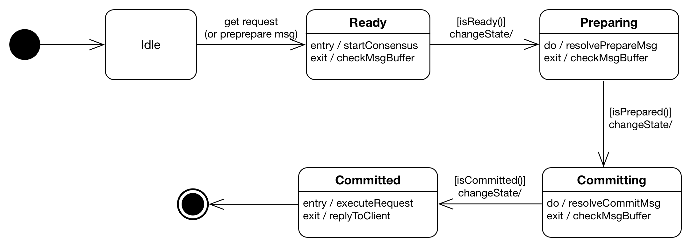
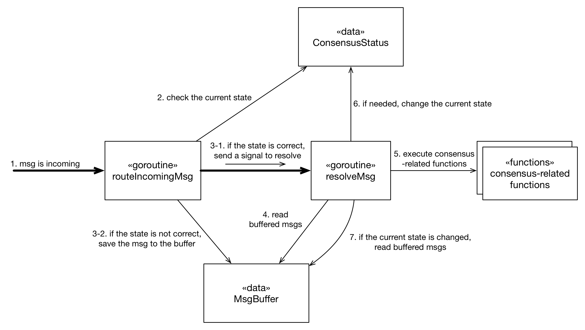

Project Implementation Details
==============================

Overview
--------

It describes the important implementation decisions of the it-chain. Sample code for each detailed implementation can be found in the sample folder.

Table of Contents
-----------------

1.	[BlockChain](#BlockChain)
2.	[SmartContract](#SmartContract)
3.	[Communication](#Communication)
4.	[Crypto](#Crypto)
5.	[Database](#DB)
6.	[Consensus](#Consesnsus)
7.	[Logical View Architecture](#LogicalView)

BlockChain 
------------------------------------

-	BlockChain

A blockchain is a continuously growing list of blocks, which are linked by a [hash](https://en.wikipedia.org/wiki/Cryptographic_hash_function) pointer as a link to a previous block.

-	Block

The block consists of a block header and block data, and the next block has a value obtained by hashing the block header for the block structure of the Ledger. The block header has the previous block hash value and the merkle tree root hash value. The block data has a transaction list and has a merkle tree To efficiently manage forgery and tampering of transactions.

-	Transaction

It is an atomic operation that performs Smart Contract. The transaction has an ID of the peer (Node) that actually executes the transaction, a transaction hash value that hashes the transaction header, and TxData which contains the contract contents.

-	MerkleTree

The Merkle Tree consists of a binary tree, and the leaf node is the hash value of the transactions in the transaction list of the block. The root node is a hash value representing the entire transaction that hashes the transaction hash value pair from the leaf node to the end. Merkle Tree is able to check in constant time whether transaction information has changed through merkle tree root hash. In addition, Merkle Tree can effectively manage the validity of all transactions in the ledger because the block header has the Merkle Tree root hash value and the next block has hash value from hashed the block header. And since Merkle Tree can provide the Merkle Path (the Sibling node to the root node of tx), it has the advantage of being able to check the validity of a particular transaction at log time.

### Author

[@emperorhan](https://github.com/emperorhan)

SmartContract 
------------------------------------------

SmartContract is stored on git repository and is executed by the smart contract service. After testing Smart Contract in a Docker-based virtual environment, it is reflected in the actual database.

-	Git

Each Smart Contract is stored as a Git Repository.

-	Docker VM

It is a virtual environment that executes smart contracts. After the smart contract and the world state db are copied to the Docker vm, they are executed and verified virtually.

-	SmartContractService

It is a service that manages git and Docker VM. After pushing and cloning the smart contract on the git, it copies the world state DB and smart contract to Docker VM and executes it.

​

#### Deploy Smart Contract Sequence Diagram

The deployed user's repository is stored and managed in the Authenticated Smart Contract Repository as shown below.

| User  Repository  Path | Smart Contract  Repository  Path | Smart Contract File Path                  |
|----------------------------------|--------------------------------------------|-------------------------------------------|
| A/a                              | {authenticated_git_id}/A_a                 | It-chain/SmartContracts/A_a/{commit_hash} |
| B/b                              | {authenticated_git_id}/B_b                 | It-chain/SmartContracts/B_b/{commit_hash} |
| C/c                              | {authenticated_git_id}/C_c                 | It-chain/SmartContracts/C_c/{commit_hash} |

### Author

[@hackurity01](https://github.com/hackurity01)

Grpc Communication 
-----------------------------------------------

</img>

Since it is complex to handle the reception and transmission of the peers' messages while maintaining the connection between the peers, the message handler is used to separate the reception and transmission and obtain the processing service using the message type.

-	ConnectionManager

The connection manager manages grpc connections with other peers in the network. Services send messages to peers through the connection manager. The reason for maintaining the connection between each peer is to make a consensus in a short time through fast block propagation.

-	Grpc Client

The grpc client is a bi-stream and can be sent or received. Both message transmission and reception are handled as go-routines, and when a message is received, it is transmitted to the MessageHandler. The client is not involved in the message content.

-	MessageHandler

The message handler receives all messages received by the grpc client, performs message validation, and forwards the message to the corresponding service according to the message type.

-	Services

Each service has a connectionManager and sends a message through the connectionManager. Services register a callback to a message of interest to the messageHandler, and process the message through a callback when the corresponding type of message is received.

​

### ConnectionManager

It-chain의 각각의 Node들이 어떻게 같은 네트워크의 다른 Node들과 데이터를 주고 받으며, Connection을 유지, 생성, 관리, 종료하는지에 대해서 좀더 자세히 설명하고자 한다.

#### Overall View

-	ConnectionManager

ConnectionManager는 Connection들을 관리한다. Connection을 생성, 관리, 종료한다. ConnectionManager를 통해 다른 Peer들과 Connection이 연결되면 Connection을 유지한채로 연결된 Connection을 통해 데이터를 송신, 수신한다. Connection을 연결시겨 놓는 이유는 합의알고리즘과 Transaction을 송,수신의 비용을 줄이기 위함이다.

-	Connection

Connection은 Peer간의 통신의 추상화이며 구현체는 Grpc Bi-Stream으로 구현되어 있다. Grpc Bi-Stream은 TCP/IP통신 처럼 Connection을 유지한채 데이터를 송,수신 할 수 있다. 각 Peer마다 하나의 Connection으로 유지되며 Connection은 clientConnection, serverConnection의 2가지 중 하나이다. Connection은 내부적으로 송신, 수신 파트를 각각 고루틴을 통해 비동기적으로 처리한다.

#### Connection Implementation details

Connection Class의 중요한 메소드와 속성들을 나타낸 Class Diagram이다. Connection 은 크게 2개의 종류로 분리된다. Connection에서 clientStream와 serverStream은 서로 동시에 존재 할 수 없다. Connection이 clientStream을 가지고 있으면 ClientConnection, serverStream을 가지고 있으면 ServerConnection으로 간주한다. 나머지 모든 로직은 동일하며 단순히 어느 Stream을 사용할지가 차이점이다.

-	ClientConnection

Peer가 grpc.ClientConn객체를 사용해 다른 Peer와 Connection 을 맺게 되면 ClientConnection이 생성된다.

-	ServerConnection

Peer가 다른 Peer로 부터 Stream 요청을 받게 되는 순간 Connection이 생성된다. 그 순간 serverStream을 인자로 받게 되는데 그 serverStream을 가진 Connection이 ServerConnection이다.

#### ClientConnection Sequence Diagram

새로운 Connection연결을 위해 ConnectionManager에게 ip와 connectionID를 전달하면, ConnectionManager는 grpcClient를 사용하여 Stream을 통해 연결을 확인한다. 연결이 될 경우 StreamClient객체를 전달받는다. Connection객체를 생성하고 StreamClient를 와 기타 여러 정보들을 Connection객체에 저장후 Connection객체를 ConnectionManager의 ConnectionMap에 저장한다.

#### ServerConnection Sequence Diagram

다른 Peer로 부터 Connection연결 요청이 들어오면 StreamServer를 받게 된다. 나에게 Connection을 요청한 Peer가 Valid한 Peer인지를 확인하기 위해 Peer정보를 요청하고 알맞은 Peer정보가 오게 되면 기타 여러 정보들을 Connection객체에 저장후 Connection객체를 ConnectionManager의 ConnectionMap에 저장한다. 그 후에 Connection 생성 이벤트를 전송한다.

### Author

[@Junbeomlee](https://github.com/junbeomlee)

Crypto 
----------------------------

Crypto signs and verifies the data used in the block-chain platform and manages the keys used in the process. *it-chain* supports `RSA` and `ECDSA` encryption method.

-	KeyGenerator

The node generates a key that matches the encryption scheme that you want to use for signing.

-	KeyManager

Stores the generated key, and loads the stored key.

-	Signer

Performs data signature.

-	Verifier

Verify the signed data.

-	KeyUtils

Perform the necessary processing tasks in the process of storing and loading the key such as converting key data to `PEM` file.

-	Key

Provides attribute values related to the interface of key data required in the signature or verification process.

 

### Signing process of data

 ​

### Author

[@yojkim](https://github.com/yojkim)

Database 
--------------------------

Blockchain can be stored in multiple types of database depend on configuration. For now leveldbhepler and fileheper functions are added. Basic DB implementation uses leveldb. Blocks can be retrieved by block hash and block number and transaction ID. Transactions can be retrieved by transaction ID. If you want to use other database, implement it under blockchainleveldb and edit blockchain_db_interface.

### Related config

Database config is defined in config.yaml as database section

-	type

Type of database. For now only leveldb is supported and little helper function for file is supported.

-	leveldb

Configuration for leveldb.

| key | description | | ------------ | ---------------------------------------- | | default_path | If no other path for leveldb is provided, leveldb data is stored in this path |

### World State DB

World State DB stores final state after all transaction executed. World state DB is copied when running SmartContract.

| DB name              | Key             | Value                  | Description                                                |
|----------------------|-----------------|------------------------|------------------------------------------------------------|
| WorldStateDB         | UserDefined Key | UserDefined Value      | Save all the information about the result of smartContract |
| WaitingTransactionDB | Transaction ID  | Serialized Transaction | Save transactions                                          |

### LevelDB

Blocks are totally stored in key-value storage leveldb.

-	Blocks

Blocks are serialized to JSON and saved in leveldb. For key block hash and block number are used. Last block and unconfirmed block are saved for recover.

-	Transactions

Also transactions are serialized and saved in leveldb. Basically all transactions are saved together block. For indexing, block hash that transaction belongs to also saved. Transaction ID is used for key.

| DB name           | Key            | Value                        | Description                     |
|-------------------|----------------|------------------------------|---------------------------------|
| block_hash        | BlockHash      | Serialized Block             | Save block using blockhash      |
| block_number      | BlockNumber    | Block Hash                   | Save block using block's number |
| transaction       | Transaction ID | Serialized Transaction       | Save transactions               |
| unconfirmed_block | BlockHash      | Serialized unconfirmed block | Save unconfirmed block          |
| util              | Predefined Key | Depends on Key               | DB for multiple usage           |

-	util DB

Util DB saves multiple things for convenience. 1) Key : last_block, Value : Serialized last block 2) Key : unconfirmed_block, Value : Serialized unconfirmed block 3) Key : transaction ID, Value : Blockhash of block that transaction is stored

-	Snapshot

LevelDB snapshot is added for copying world state db which is stored in leveldb.

### File

Block's metadata is saved in leveldb or other key-value database. Block body is saved in file.

-	Blocks

Block's metadata is serialized to JSON and saved in leveldb. Block body data is written into file.

-	Transactions

Transaction data is stored in file. For finding, information of the file is stored in key-value database using transaction ID as key.

### Author

[@luke9407](https://github.com/luke9407)

Consensus 
----------------------------------

### Proposed architecture for the PBFT consensus

The consensus process starts when the request message (if the node is the primary) or the pre-prepare message arrives. Then, the state is changed to `Ready` and the node starts the consensus (e.g. create required structs and goroutines.). When it is done, the node checks the message buffer if there is any message arrived earlier and proceeds to the `Preparing` state. In the `Preparing` state, the node resolves prepare messages until `isPrepared` is true. If then, same as in the previous state, the node checks the message buffer and proceeds to the `Committing` state. `Committing` state is same with `Preparing` state. Then, if `isCommitted` is true, the node's state is changed to `Committed`, executes the request's operation and replies the result of the operation to the client.

To do the PBFT consensus, the proposed code structure is like this diagram. The `routeIncomingMsg` goroutine is a daemon goroutine to take incoming consensus-related messages and route them to the appropriate location in the buffer. The `resolveMsg` goroutine reads messages from the buffer and call the appropriate consensus-related functions. If needed, this goroutine changes the state of the consensus like `Preparing` or `Committing`.

Overall behaviors are like the above diagram. When the `routeIncomingMsg` goroutine takes an incoming message, it first checks the state of the consensus. If the state is not correct, it saves the message to the buffer. If the state is correct, it send a signal to resolve the buffered messages to the `resolveMsg` goroutine. Then, the `resolveMsg` goroutine reads buffered messages and calls consensus-related functions. If needed, this goroutine change the current state. If the current state is changed, the `resolveMsg` goroutine checks buffered messages for the new state immediately without waiting the resolving signal.

This propose can be different with the detail implementation.

### Author

[@Junbeomlee](https://github.com/junbeomlee)

[@Hwi Ahn](https://github.com/byron1st)
